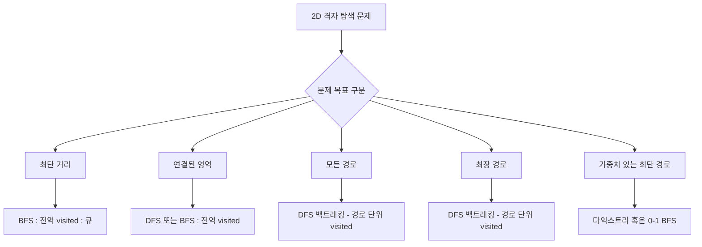

# 📘 TIL: 2차원 리스트(격자)에서 DFS & BFS 탐색 정리

## 1. 왜 2차원 탐색이 중요한가?

- **격자(2D grid)**는 코딩 테스트에서 가장 자주 나오는 그래프 구조.
- 대표 문제: 미로 탐색, 섬 개수 세기, 최단거리 찾기, 등산로 조성, 영역 넓이 구하기.
- **각 칸을 노드**, 상하좌우 인접 칸을 **간선**으로 보는 것이 핵심.

------

## 2. 탐색 기본 원칙

1. **이동 방향 정의**

   ```python
   dirs = [(1,0), (-1,0), (0,1), (0,-1)]  # 상하좌우
   ```

   - 대각선까지 고려할 땐 `(1,1), (1,-1), ...` 추가.

2. **격자 범위 검사**

   ```python
   if 0 <= nx < N and 0 <= ny < M:
       # 범위 안에 있는 경우만 탐색
   ```

3. **방문 여부 관리**

   - 전역 visited: 최단거리, 영역 탐색
   - 경로 단위 visited: 모든 경로 탐색, 최장 경로
   - 구현 방법:
     - `visited = [[0]*M for _ in range(N)]`
     - 또는 `visited = set()` 에 `(x,y)` 튜플 저장

------

## 3. BFS in 2D (최단거리 탐색)

```python
from collections import deque

def bfs(start, grid):
    N, M = len(grid), len(grid[0])
    visited = [[0]*M for _ in range(N)]         # 방문 여부
    q = deque([(start[0], start[1], 0)])        # (x, y, dist)
    visited[start[0]][start[1]] = 1             # 시작 방문 처리
    
    while q:
        x, y, d = q.popleft()
        print(f"현재 위치: {(x,y)}, 거리: {d}")

        for dx, dy in [(1,0),(-1,0),(0,1),(0,-1)]:
            nx, ny = x+dx, y+dy
            # 범위 안 + 길(1) + 미방문
            if 0 <= nx < N and 0 <= ny < M and grid[nx][ny]==1 and not visited[nx][ny]:
                visited[nx][ny] = 1
                q.append((nx, ny, d+1))
```

✅ 특징

- **최단 거리** 보장.
- 미로 문제, 토마토 익기 문제 등에 필수.
- `dist`를 큐에 함께 저장하거나 `distance` 배열을 따로 둔다.

------

## 4. DFS in 2D (영역 탐색 / 경로 탐색)

### (1) 전역 visited → 영역 탐색

```python
def dfs_area(x, y, grid, visited):
    N, M = len(grid), len(grid[0])
    visited[x][y] = 1    # 방문 처리

    for dx, dy in [(1,0),(-1,0),(0,1),(0,-1)]:
        nx, ny = x+dx, y+dy
        if 0 <= nx < N and 0 <= ny < M and grid[nx][ny]==1 and not visited[nx][ny]:
            dfs_area(nx, ny, grid, visited)
```

✅ 특징

- 섬의 개수, 영역 크기 등 “연결된 부분” 탐색에 사용.
- `visited`는 **전역** 관리.

------

### (2) 백트래킹 → 경로/최장 경로 탐색

```python
def dfs_path(x, y, grid, visited, length):
    N, M = len(grid), len(grid[0])
    best = length
    visited.add((x,y))   # 현재 경로 방문 처리

    for dx, dy in [(1,0),(-1,0),(0,1),(0,-1)]:
        nx, ny = x+dx, y+dy
        if 0 <= nx < N and 0 <= ny < M and grid[nx][ny]==1 and (nx,ny) not in visited:
            best = max(best, dfs_path(nx, ny, grid, visited, length+1))

    visited.remove((x,y)) # ✅ 백트래킹
    return best
```

✅ 특징

- 경로를 따라가며 가능한 모든 경우 탐색.
- 최장 경로, 모든 경로 경우의 수 같은 문제에서 사용.

------

## 5. DFS vs BFS in 2D

| 항목      | BFS                           | DFS                                    |
| --------- | ----------------------------- | -------------------------------------- |
| 탐색 순서 | 가까운 칸부터 레벨 단위       | 한 갈래 끝까지 깊이 탐색               |
| 보장      | 최단 거리 보장                | 최장 거리, 모든 경로 탐색 가능         |
| visited   | 전역 (한 번 방문 = 끝)        | 전역(영역 탐색) or 경로 단위(백트래킹) |
| 주 사용처 | 미로 최단거리, 최소 이동 횟수 | 섬의 개수, 최장 경로, 경로 개수        |

------

## 6. 문제 접근 전략

1. **문제 목표 확인**
   - 최단 거리? → BFS
   - 최장 거리 / 모든 경로? → DFS + 백트래킹
   - 영역 탐색? → DFS or BFS (visited 전역)
2. **격자 모델링**
   - `(r,c)`를 노드, 상하좌우를 간선으로 생각
   - 입력 grid가 0/1, 높이, 알파벳인지에 따라 조건 설정
3. **visited 설계**
   - 중복 방문이 문제면 전역 visited
   - 경로 경우의 수가 필요하면 백트래킹
4. **시간복잡도 체크**
   - BFS/DFS 기본은 `O(N*M)`
   - 백트래킹은 최악 exponential → 보통 N ≤ 8 같은 작은 제한

------

# ✅ 마무리

앞으로 2차원 격자 DFS/BFS 문제를 풀 때는:

- **“최단 거리냐? 최장 거리냐? 영역 탐색이냐?”**
- 목표에 맞게 BFS vs DFS + visited 전략 선택
- 항상 **이동 방향 정의 + 범위 검사 + visited 처리** 세 가지를 틀로 잡기

---





## 📝 플로우차트 읽는 법

- 문제를 보면 **먼저 목표를 묻는다**:
  - 최단 거리? → **BFS**
  - 최장 거리? → **DFS + 백트래킹**
  - 단순 영역 탐색? → **DFS/BFS 둘 다 OK**
  - 모든 경로 경우의 수? → **DFS + 백트래킹**
  - 가중치 있는 최단경로? → **다익스트라 / 0-1 BFS**


---


## 📌 유형별 대표 예시 문제

### ✅ 최단 거리 (BFS, 전역 visited)

- **백준 2178**: 미로 탐색
- **백준 7576**: 토마토
- **백준 1697**: 숨바꼭질 (1차원 BFS지만 대표적)


### ✅ 연결된 영역 탐색 (DFS/BFS, 전역 visited)

- **백준 2667**: 단지번호붙이기 (DFS/BFS 모두 가능)
- **백준 1012**: 유기농 배추
- **백준 4963**: 섬의 개수 (대각선 포함 탐색)


### ✅ 모든 경로 탐색 (DFS + 백트래킹, 경로 단위 visited)

- **백준 1189**: 컴백홈 (정해진 이동 횟수로 집 도착 경로 수 구하기)
- **백준 1987**: 알파벳 (중복 없는 경로 탐색 → 사실상 최장 경로 + 백트래킹)


### ✅ 최장 경로 탐색 (DFS + 백트래킹)

- **SWEA 1949**: 등산로 조성
- **백준 1937**: 욕심쟁이 판다 (DP + DFS 메모이제이션, “최장 경로” 변형)
- **백준 1987**: 알파벳 (모든 경로 탐색이자 최장 경로 문제로도 분류됨)


### ✅ 가중치 있는 최단 경로 (다익스트라 / 0-1 BFS)

- **백준 1261**: 알고스팟 (0-1 BFS)
- **백준 13549**: 숨바꼭질 3 (0-1 BFS)
- **백준 1753**: 최단경로 (다익스트라)