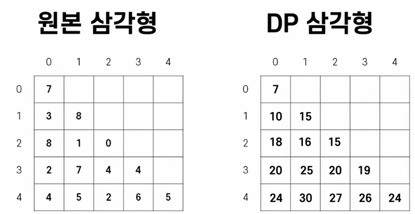

[영상 링크](https://www.youtube.com/watch?v=0bqfTzpWySY)

## 핵심

- 모든 알고리즘은 기존에 있었던 문제를 해결하기 위해 고안되었다.

  - DP는 완전탐색 / DFS / BFS와 같이 수많은 경우의 수를 따져보는 문제에서, 그 경우의 수가 너무 많아서 속도가 느려지는 문제를 개선하고자, 그럼으로써 수행하는 시간을 단축시키고자 만들어진 알고리즘입니다.

  1. DFS 에서 중복되는 계산이 많을 때 DP 연산을 고려해볼 수 있다.
     (DFS 완전탐색으로 풀 수 있는 마지노선은 대충 500만개의 경우의 수)

  2. DP는 답이 되지 않는 경우는 애초에 제거해나가며 중복되는 계산을 줄일 수 있기 때문이다.

  -> 다이나믹 프로그래밍의 목적을 한 줄로 요약하면 메모리를 사용해서 중복 연산을 줄이고 중복 연산을 줄여서 수행 속도를 개선한다는 것

  -> '기억하며 풀기'로 이해하면 보다 직관적인게, 말 그대로 연산한 내용을 기억해 놓고 다음에도 그 연산이 필요할 때 기억해 놓은 값을 사용해서 문제를 푸는 게 다이나믹 프로그래밍의 전부

- 대표 적용 사례 : 프로그래머스 [정수 삼각형] 문제

  - -> DP 풀이를 하다보면 새로운 자료구조(메모리)를 하나 만들게 된다.

DP로 풀어야지! 라고 판단하는 기준

1. DFS BFS로 풀 수 있지만 경우의 수가 너무 많은 문제
2.  그 경우의 수 간에 중복 연산이 많은 문제

DP식 사고방식 습득법

1. 최대한 많은 문제 풀기
2. 30분 정도 고민하고 답이 안 나오면 풀이를 참고해서 직접 구현을 하기
3. 단, 그 30분 동안은 어떻게 하면 뒤로 돌아가지 않을 수 있을까 고민해야 한다.
   즉, 직전 연산을 또 하지 않으려면 어떤 정보를 남겨야하고,
   어떤 식으로 정보를 누적해야하지라는 질문을 스스로에게 던지자.

---

## 강의 전체 내용

오늘은 다이나믹 프로그래밍이 왜 필요하고 예제를 통해 DP 장점을 이해해 보겠습니다.
그러고 나서 코딩 테스트를 보는 사람 입장에서 DP 문제를 어떻게 알아보고 구분하기 그 특징들을 정리해 보고 마지막으로 어떻게 접근해야 조금 더 쉽게 풀 수 있는지까지 샅샅이 정리해 보겠습니다

### 다이나믹 프로그래밍의 목적
우리가 프로그래밍을 배울 때 항상 기억해야 되는 것은 모든 알고리즘은 기존에 있었던 문제를 해결하기 위해서 고안되었다는 것입니다 다른 말로 아무 이유 없이 한 천재의 똑똑함을 자랑하고자 복잡하고 이해하기 어려운 알고리즘을 만들지 않았기 때문에 이 알고리즘이 왜 필요한지를 이해한다면 어떤 문제에 적용할지 그리고 어떻게 적용할지를 빠르게 익힐 수 있습니다 
다이나믹 프로그래밍은 완전 탐색 dfs bfs 같이 수많은 경우의 수를 전부 따져 봐야 하는데 그 경우의 수가 너무 많아서 속도가 느려지는 문제를 개선하고자 그래서 수행 시간을 단축하고자 만들어진 알고리즘입니다
그러면 반대로 다이나믹 프로그래밍이 없던 시절에는 최단 경로를 찾거나 최고 점수를 만들거나 하는 등의 문제를 풀려면 결국 모든 조합을 다 만들어 보는 수밖에 없었습니다 하지만 DP라는 알고리즘이 만들어진 이후에는 수행 시간을 현저하게 줄일 수 있었는데 이거는 예제를 보면서 설명드리겠습니다 

### 예제 시작 : 프로그래머스 - 정수 삼각형

프로그래머스 정수 삼각형이라는 문제를 보면 그림과 같이 삼각형의 숫자들이 주어지고 위에 꼭지점에서 시작해서 왼쪽이나 오른쪽 대각선으로 이동할 수 있다고 할 때 가장 높은 점수를 만들 수 있는 값이 얼마인지를 찾아야 하는 문제입니다 다이나믹 프로그래밍이 없었다면 dfs 사용해서 7 3 8 2 4를 더해서 24라는 숫자를 구하고 맥스라는 변수를 갱신하고 그다음에는 7 3 8 2 5를 더해서 25라는 합이 나왔으니 또 맥스를 갱신하고 그다음에는 7 3 8 7 5를 더해서 30이라는 값을 맥스로 갱신하고 이 동작을 반복해서 모든 경우의 수를 다 따져 보면 30이라는 값이 최대값이라는 것을 알 수 있습니다 
다섯 줄짜리 삼각형이라면 dfs로 푸는 데 지장이 없지만 문제 제한 사항에 나온 대로 500줄짜리 삼각형이라면 경우의 수가 너무 많아질 것 같다는 불길한 예감이 듭니다
 그런데 dfs 동작을 보니 중복적인 연산이 많습니다 예를 들어 7+3의 연산을 여러 조합에서 반복하고 있었던 겁니다 그렇다면 이런 연산 횟수를 어떻게 줄이고 빠르게 문제를 풀지 설명을 해보겠습니다 다이나믹 프로그래밍이 왜 좋은지를 이해하려면 지금부터 최대한 집중하셔서 끝까지 들어 주시기 바랍니다  

우선 컴퓨터에게 대각선이란 존재하지 않기 때문에 컴퓨터가 보기 쉽게 직각삼각형의 형태로 바꿔 보겠습니다 그럼 한 숫자에서 내려갈 수 있는 길은 왼쪽 오른쪽이 아닌 밑으로 가거나 내 밑에 오른쪽으로 가거나 두 가지 경우의 수가 있다고 정의하겠습니다 

### 연산 과정 전체 설명

연산을 줄이기 위해서는 한 번 수행한 연산의 결과를 저장해 둬야 하는데 이 문제에서는 이 삼각형과 똑같이 생긴 배열을 하나 더 만들겠습니다 왼쪽의 삼각형이 문제에서 주어졌던 값을 그대로 갖고 있다면 오른쪽에 우리가 만들 DP 삼각형은 해당 위치까지 올 수 있는 최댓값을 저장하는 배열이 될 겁니다 이게 무슨 말인지는 조금 더 따라오시면 이해될 겁니다 그러면 가장 위에 있는 7번부터 시작하겠습니다 7번은 시작점이기 때문에 여기까지 올 수 있는 최댓값은 항상 본인 자신이고 그래서 7이라는 값을 대입해 줍니다 그러면 7이라는 값에서 내려갈 수 있는 길은 1 0과 1 1 두 가지입니다 우선 1 0으로는 0 0까지 올 수 있었던 최대값인 7에 1 0에 있는 3이라는 숫자를 더해 10이라는 값을 만들어 봅니다 그리고 이 값이 현재 DP 삼각형에 있는 1 0의 값보다 크기 때문에 이 위치의 값을 바꿔 줍니다 즉 1 0까지 올 수 있는 최댓값은 10이라고 저장해 두는 거죠 동일하게 1 1로 내려가 보면 0 0까지 올 수 있었던 최댓값 7에 1 1에 있는 숫자 8을 더해서 15라는 숫자를 만들고 이 값이 여태까지 있었던 최댓값은 0보다 크기 때문에 DP 삼각형의 1 1에는 15라는 숫자를 담아 줍니다 그러면 1번 줄까지 내려올 수 있는 최댓값을 전부 구했기 때문에 1번 줄에서 2번 줄로 내려가는 최댓값을 구해보겠습니다 1 0까지 최대값인 10에 2 0의 값인 8을 더해서 18이라는 값이 DP 삼각형의 2 0에 담기게 됩니다 그리고 동일하게 DP 삼각형의 2 1에는 10의 1을 더해서 11이라는 값이 남기겠지 그러면 이번에는 1 1에서 시작해서 2 1로 내려와 보겠습니다 1 1까지의 최대값인 15에 2 1에 있는 1이라는 값을 더하니 16이 됩니다 그럼 이 값은 여태까지 있었던 11이라는 최댓값보다 크기 때문에 DP 삼각형의 2 1의 값을 11에서 16으로 갱신해 줍니다 여기서 11이라는 값을 16으로 바꿔 준 동작의 의미를 파악해 보면 이전까지 2 1로 올 수 있었던 최댓값은 7 3 1의 조합으로 만들어진 11이라는 값이었는데 7 8 1이라는 조합도 있어서 진짜 최댓값은 16이라고 하고 갱신해 준 겁니다 그렇기 때문에 2 1에서 다시 연산을 시작할 때는 7 3 1이라는 조합의 연산은 전부 무시하고 7 8 1의 조합만 고려하게 되는 겁니다 dfs는 7 3 1이라는 조합을 전부 다 수행했지만 DP를 활용했기 때문에 7 3 1의 조합은 전부 무시하고 오직 7 8 1의 조합만 고려하는 것이 DP의 장점인 겁니다 그러면 마지막으로 1 1에서 2 2로 내려가는 최적의 값을 계산해 보면 15에 0을 더해 15가 됩니다 이렇게 이번 줄까지 연산을 마무리했는데 여기서 한번 DP 장점을 정리해 보겠습니다 
2번 줄까지 올 수 있는 최적의 조합을 DP 삼각형에 입력할 때 1번 줄의 값들만 참고하고 0번 줄은 전혀 참고하지 않았습니다 왜냐하면 1번 줄까지 올 수 있는 최적의 값에는 이전의 모든 조합들 중 최고의 값만 남겨 놨기 때문에 이전의 정보를 볼 필요가 없어진 거죠 그러면 3번 줄을 연산할 때도 똑같이 2번 줄까지의 최댓값을 활용해서 연산을 줄여 보겠습니다 2 0을 기준으로 보면 3 0은 여태까지의 값 18에 2를 더해서 20을 담고 3 1은 25를 담겠습니다 2 1의 최댓값 16에 7을 더해서 23이 되지만 3 1에는 이미 25라는 더 큰 값이 있기 때문에 갱신하지 않고 3 2에만 20을 담아 줍니다 2 2의 최댓값 15에 4를 더해서 19라는 값이 나오지만 3 2의 최댓값 20보다 작기 때문에 갱신하지 않고 3 3만 19로 갱신해 줍니다 이렇게 3번 줄까지 최댓값을 갱신했는데 이때도 마찬가지로 2번 줄의 값들만 확인했지 그 이전의 값들은 고려하지 않았습니다 왜냐하면 이미 0번과 1번 줄의 최댓값이 2번 줄에 다 녹여져 있기 때문에 0번과 1번 줄에 있는 값들을 다시 연산하지 않아도 되는 겁니다 마지막 줄을 완성해 보면 3 0의 최댓값 20에 4 0의 값 4를 더해서 24라는 값을 담고 4 1에는 25라는 값을 담겠습니다 3 1의 최댓값 25를 기준으로 4 1의 값은 30으로 갱신하고 4 2는 27로 담습니다 3 2의 최댓값 20을 기준으로 4 2의 2라는 값을 만들 수 있지만 27보다 작기 때문에 갱신하지 않고 4 3만 26을 담아 줍니다 3 3의 최댓값 19를 기준으로 4 3에는 25라는 값을 만들 수 있지만 26보다 작기 때문에 갱신하지 않고 4 4에 24를 담아 줍니다 이렇게 DP 삼각형을 완성하고 나면 마지막 4번 줄에서의 최댓값이 우리가 찾는 정답이 되고 그래서 30이라는 값이 나오게 되는 겁니다 

### 예제 정리

예제를 통해서 본 내용을 정리해 보겠습니다 **다이나믹 프로그래밍의 목적을 한 줄로 요약하면 메모리를 사용해서 중복 연산을 줄이고 중복 연산을 줄여서 수행 속도를 개선한다**입니다 메모리를 사용한다는 것은 DP 삼각형과 같이 또 하나의 배열 혹은 자료 구조를 만든다는 것을 의미하고 이를 통해 중복 연산을 줄인다는 것은 한 번 연산한 결과를 배열에 담아서 다시는 같은 연산을 또 하지 않는다는 것입니다 
그래서 이번 정수 삼각형 문제에서의 핵심은 DP 삼각형을 어떻게 정의하고 값을 차곡차곡 쌓아서 중복 연산을 줄이냐는 것이었습니다 

### 왜 다이나믹 프로그래밍이라고 하는 거에요?

그럼 이쯤에서 많은 분들이 질문합니다 왜 이걸 다이나믹 프로그래밍이라고 하는 건가요 그 나름의 이유는 있지만 이유를 보고도 썩 와닿진 않아서 굳이 여러분들을 설득하려고 노력하지 않겠습니다 다만 한 교수님은 이 알고리즘을 기억하기 알고리즘 혹은 기억하며 풀기라고 번역했는데 이게 훨씬 직관적인 이름인 것 같습니다 **말 그대로 연산한 내용을 기억해 놓고 다음에도 그 연산이 필요할 때 기억해 놓은 값을 사용해서 문제를 푸는 게 다이나믹 프로그래밍의 전부**입니다 

두 번째 다이나믹 프로그래밍 문제를 알아보고 구분하기 이해하셨으면 다이나믹 프로그래밍은 특정 유형에 국한되지 않고 다양한 유형의 문제를 최적화할 때 고려될 수 있는 알고리즘입니다 

### DP로 풀어야겠다고 판단할 수 있는 기준 1

#### 1. DFS BFS로 풀 수 있지만 경우의 수가 너무 많은 문제

그렇다면 코딩 테스트나 알고리즘 문제를 보고 **이건 DP로 풀어야겠다라고 판단할 수 있는 기준**을 두 가지로 정리해 봤습니다 **첫 번째는 dfs bfs로 풀 수는 있지만 경우의 수가 너무 많은 문제**입니다 정수 삼각형도 다섯 줄이라면 그냥 dfs로 풀면 되지만 500줄이 되면 절대 불가능합니다 
이런 문제를 풀면서 최악의 경우의 수를 계산하는 가장 쉬운 방법은 직접 계산해 보는 겁니다 정수 삼각형 문제라면 한 줄짜리 삼각형부터 수를 계산해서 패턴이 보일 때까지 반복하는 겁니다 한 줄짜리 삼각형이 있다면 경우의 수는 7 한 개입니다 두 줄짜리 삼각형이라면 경우의 수는 7 3 혹은 7 8 해서 두 개가 됩니다 세 줄짜리가 있다면 7 3 8 7 3 1 7 8 1 7 8 0 해서 네 개가 됩니다 이 정도만 봐도 패턴이 1로 시작해서 두 배씩 증가하는 것처럼 보입니다 그렇다면 네 줄짜리 삼각형이 여덟 가지 경우의 수인지 확인해 보면 되는데 실제로 세어보면 총 여덟 개의 조합이 존재합니다 그럼 한 줄일 때는 하나 두 줄일 때는 둘 세 줄일 때는 넷 네 줄일 때는 여덟 가지의 조합인데 이걸 쉽게 말하면 1부터 시작해서 두 배씩 증가하는 거고 수학적으로 표현하면 2의 n-1승이 됩니다 
처음부터 수학적으로 정리해야 될 필요는 전혀 없습니다 저도 항상 처음 몇 개는 손으로 직접 세 보고 패턴이 보이면 그때 계산을 하기 위해 수학적인 식을 도출합니다 이렇게 식이 나왔고 문제에서 말한 최대는 500이기 때문에 최악의 경우의 수는 2의 499승이 되고 이건 1.63 * 10의 150승이라는 어마어마한 값이 됩니다 
제가 dfs 완전 탐색으로 풀 수 있는 마지노선을 대충 500만 개의 경우의 수라고 말씀드렸는데 이 기준이 5 * 10의 6승입니다 그러면 1.63 * 10의 150승은 163만이라는 숫자에 0을 144개 더 붙인 값이 되기 때문에 이 정도면 완전 탐색으로는 절대 답이 안 나온다고 판단할 수 있고 DP를 어떻게 구현할지 고민해 봐야 합니다 

#### 경우의 수들의 중복적인 연산이 많은 문제

**두 번째 기준은 그 경우의 수들의 중복적인 연산이 많은 문제**입니다 이 문제도 dfs로 풀었다면 모든 조합을 매번 다 해봤을 겁니다 그런데 딱 보니 이미 최댓값이 될 수 없는 조합들도 계속 연산을 해서 시간을 낭비하고 있는 겁니다 우리는 이걸 줄이고자 각 위치까지 올 수 있는 최적의 값만 남겨 놓고 나머지 조합은 다 버렸습니다 이렇게 하고 나면 어차피 안 될 조합들은 미리 버려서 가장 좋은 조합들끼리만 다시 경쟁을 시키고 그 중 가장 좋은 조합을 줄이는 식으로 반복해서 문제를 풀어냈습니다 <u>중복 연산을 어떻게 줄일지 고민하는 건 어렵지만 최소한 중복 연산이 많다는 것은 DP 문제를 몇 개 풀다 보면 쉽게 감을 잡을 수 있을 겁</u>니다 

### DP식 사고방식을 습득하자

세 번째 문제 해결 접근 방법이 문제는 DP로 풀어야겠다라고 판단을 잘했다면 이제 풀 일만 남았는데 이것도 만만치 않죠 우선 피드백 말로 **최대한 많은 문제들을 풀어보고 풀이들을 참고하면서 DP식 사고 방식을 습득할 필요**가 있습니다 아무것도 모르는 상태에서 스스로 터득하기에는 시간이 아주 오래 걸리니 DP 한 문제만큼 오래 붙잡고 있기보다는 30분 정도 고민해 보시고 **답이 안 나오면 풀이를 참고해서 직접 구현만 해 보는 방식을 강하게 추천**드립니다 **그 30분 동안은 어떻게 하면 뒤로 돌아가지 않을 수 있을까를 고민해야 되는 겁니**다 즉 현재 단계까지 연산을 잘했는데 그 연산을 또 하지 않으려면 어떤 정보를 남겨야 하지 어떤 식으로 정보를 누적해야 하지라는 질문을 스스로 던져야 하는 겁니다 

DP 삼각형과 같이 **나만의 자료 구조를 하나 더 만들고 거기에 어떤 정보를 담아야 이전 단계로 돌아가지 않을지 고민**해 보는 겁니다 비유적으로 표현하면 **여태까지의 최적의 답을 쌓아 간다는 마음**으로 프로그래밍을 하는 겁니다 어떤 정보를 어떻게 쌓아야 연산 횟수를 가장 줄일 수 있을까를 고민하다 보면 머리가 깨질 겁니다 정답이 처음부터 생각나진 않더라도 좋은 풀이들은 많이 참고하시면서 DP식 사고 방식을 장착하면 어느 순간 눈이 트일 겁니다 

DP라는 알고리즘은 큐나 스택처럼 정형화된 알고리즘이 아닙니다 제가 구현한 큐나 다른 개발자가 구현한 큐나 거의 동일하겠지만 DP는 완전히 다를 수 있습니다 DP는 정해진 구조를 그대로 구현하는 하나의 자료 구조가 아니라 수행 시간을 단축할 수 있는 기법이기 때문에 그 기법을 구현할 방법은 끝도 없이 많습니다 그러니 문제와 풀이들을 많이 참고하시고 중간중간 이 영상도 복습하시는 게 큰 도움이 될 겁니다 지금 영상을 보시고도 이해했다고 생각하시겠지만 문제를 더 풀어보고 고민하고 다시 영상을 보면 원래 이런 얘기도 있었나라고 느낄 정도로 훨씬 깊게 이해할 겁니다 

제가 드리고자 하는 말씀은 DP 유형은 엄청 어렵다는 겁니다 여러분만 어려운 게 아니니까 너무 낙담하지 마시고 DP식 사고 방식을 그냥 받아들인다는 마음으로 꾸준히 하시면 분명히 이해하는 날이 올 테니 끝까지 포기하지 마시고 도전해 보시기 바랍니다

