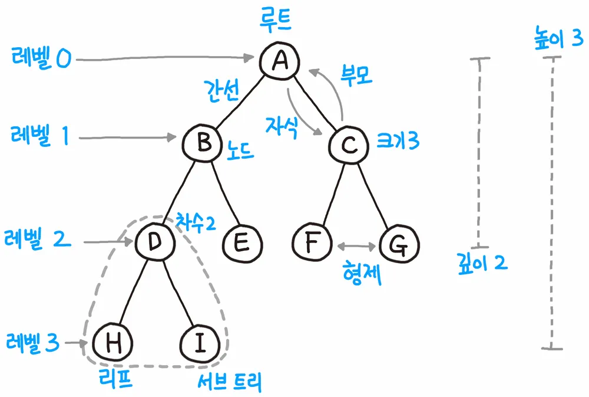
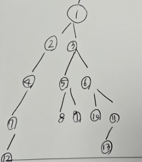
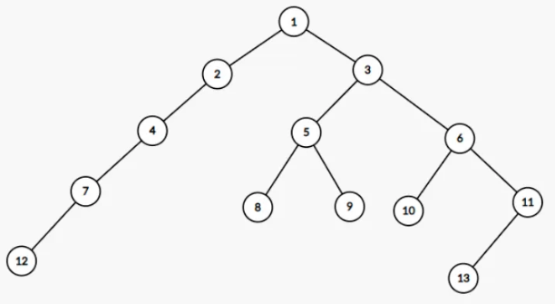
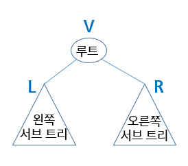
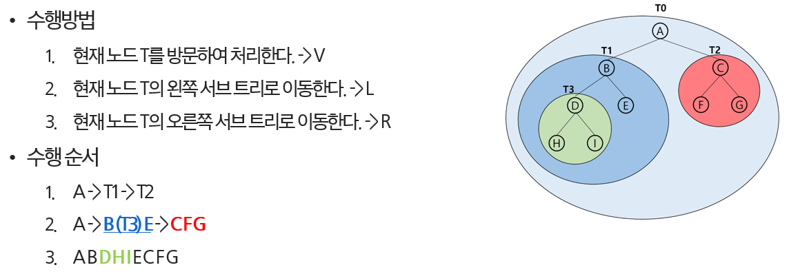
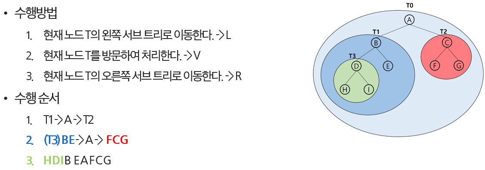
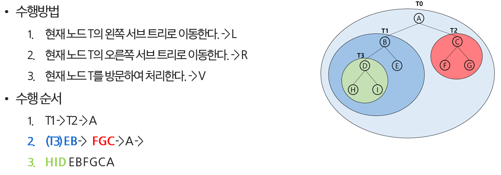

# 트리


트리는 <u>**비선형 구조**</u>이자, <u>**계층형 구조**</u>입니다.

** 계층형 : 데이터들이 상하 관계를 갖는

** 비선형 : 하나의 데이터 뒤에 여러 개의 데이터가 올 수 있는 구조





**노드** : 트리를 구성하는 각각의 요소

**루트 노드** : 가장 위에 있는 시작 노드(부모가 없는 최상위 노드)

**부모 / 자식 / 형제** : 노드 간의 관계를 나타내는 용어

**리프 / 단말 노드**  : 가장 마지막에 있는 노드(자식이 없는 최하단 노드 )

**간선** : 노드와 노드를 연결하는 선


---


우리는 노드 정보와 간선 정보를 이용하여 트리를 그리고, 문제를 풀이하게 됩니다.


---


**노드의 차수**는 특정 노드가 가진 직계 자식 노드의 개수(딸, 아들 몇 명?)를 의미한다.

(예 : 리프 노드의 차수는 무조건 0이다.)


**트리의 차수**는 max(모든 노드의 차수)를 이야기한다.

(예 : 이진 트리의 차수는 2)


---


깊이와 레벨은

"루트(시작점)에서부터 아래로 얼마나 내려왔는가?" 를 측정합니다.

**노드의 깊이**는 루트 노드에서 특정 노드까지의 경로 길이(간선의 수)입니다. (루트 노드의 깊이는 0)


**노드의 높이**는 특정 노드에서 가장 아래에 있는 리프 노드까지의 가장 긴 경로 길이 (리프 노드의 높이는 0)

**트리의 높이**는 트리에서 가장 긴 경로의 길이로, 결국 루트 노드의 높이와 같습니다.


예시로 자세히 보겠습니다.

```tex
       A (깊이:0, 높이:3)
      / \
     B   C (깊이:1, 높이:1)
    / \   \
   D   E   F (깊이:2, 높이:0)
  /
 G (깊이:3, 높이:0)
```

루트의 높이는 가장 긴 간선의 길이로부터 찾아야합니다.


단계 2 : 트리 저장을 위한 자료구조 준비

```python
V = int(input())  # V: 정점(Vertex)의 총 수
E = V - 1  # E: 간선(Edge)의 수

# 노드 번호와 인덱스를 일치시키기 위해 V+1 크기로 생성
# 노드 번호가 1번부터 시작하니까, 인덱스를 편하게 쓰기 위해 V+1 크기로 만드는 것
left = [0] * (V + 1)   # 각 노드의 왼쪽 자식 정보
right = [0] * (V + 1)  # 각 노드의 오른쪽 자식 정보

# 이제는, 부모 번호를 인덱스로 사용하여
# 왼쪽 자식과 오른쪽 자식 정보 저장하면 됨.
# 부모는 만들 필요 없이, 자식들에 대해서만 정보를 채워두면 된다.

# 
```


```python
# 간선 정보를 edge로 받아오기
edge = list(map(int, input().split()))
# 1 2 1 3 2 4 3 5 3 6 4 7 5 8 5 9 6 10 6 11 7 12 11 13
# 해석
# 부모 1 -> 왼쪽자식2
# 부모 1 -> 오른쪽 자식 3
# 부모 2 -> 왼쪽 자식 4
# 부모 3 -> 왼쪽 자식 5
# 부모 3 -> 오른쪽 자식 6
# ...
```


```python
# 간선 정보를 2개씩 (부모, 자식) 짝지어 순회
for i in range(E):  # E : 간선의 수
    # 두 개씩 등록
    # 짝수번째(0)은 부모 정보
    # 홀수번째(1)은 자식 정보
    # 간선 정보에서 왼쪽은 항상 parent 오른쪽은 항상 child입니다.
    parent, child = edge[i * 2], edge[i * 2 + 1]

    # ----- 왼쪽 자식부터 채워야합니다. ----- #
    
    # parent 노드의 왼쪽 자식이 비어있으면(0) 왼쪽 자식으로 등록
    if left[parent] == 0:
        left[parent] = child
    # 왼쪽 자식이 이미 있다면, 오른쪽 자식으로 등록
    else:
        right[parent] = child

# --- 트리 구조 생성 결과 확인 ---
# print('왼쪽 자식 정보:', left)
# print('오른쪽 자식 정보:', right)


'''
왼쪽 자식 정보: [0, 2, 4, 5, 7, 8, 10, 12, 0, 0, 0, 13, 0, 0]
오른쪽 자식 정보: [0, 3, 0, 6, 0, 9, 11, 0, 0, 0, 0, 0, 0, 0]
'''
```

직접 그려보면서 이해하는 것도 좋습니다.






## 5. 트리 순회

참고로, 트리는 각 노드를 중복되지 않게 전부 방문해야합니다.

순회는 재귀 함수를 이용해서 구현합니다


<사전 지식>



V = visit

L = left subtree

R = right subtree


순회의 방법에는 3가지가 있습니다.

- 3가지의 기본적인 순회 방법
  1. 전위순회(preorder traversal): VLR
     - 루트 노드를 **가장 먼저** 방문(처리)한 뒤, 왼쪽과 오른쪽 서브트리를 차례로 방문하는 방식
  2. 중위순회(inorder traversal): LVR
     - 왼쪽 서브트리를 **모두 방문한 후**, 루트 노드를 방문(처리)하고, 그 다음 오른쪽 서브트리를 방문
  3. 후위순회(postorder traversal): LRV
     - 왼쪽과 오른쪽 서브트리를 **모두 방문한 후**, **마지막으로** 루트 노드를 방문한다.


1. 전위순회




1. 중위순회

   

   

   

2. 후위순회

   

