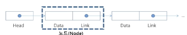

# 연결 리스트

연결 리스트는 동적 메모리 관리 방법이다.

즉, 연결리스트는 메모리를 동적으로 관리한다. (유연하게 관리한다.)

스택 : 선입후출 / 후입선출, 선형구조, top포인터를 이용해서 할 수 있다.

큐 : 선입선출 , front와 rear 포인터를 사용하여 구현한다. 그러나, 선형 큐의 한계(재사용 어려움) 때문에 원형 큐를 사용했었쬬. 1차원 리스트를 사용하나, 논리적 연결을 위해서 % 사용. 하나는 비워두고요.

비어있다 => front = rear

꽉 찼다 => front  = rear+1

연결리스트

- 자료의 논리적인 순서와 메모리 상의 물리적인 순서가 **일치하지 않고,** 개별적으로 위치하고 있는 각 원소를 연결하여 하나의 전체적인 자료구조를 이룬다.
- 링크를 통해 원소에 접근하므로, 리스트에서 **물리적인 순서를 맞추기 위한 작업이 필요하지 않다**.
- 자료구조의 크기를 **동적으로 조정**할 수 있어, **메모리의 효율적인 사용**이 가능하다.

메모리주소만 딱 바꿔치기 하면, 리스트를 다 바꾸고 하는 그런 과정들이 싹 없어지므로, 되게 효율적이겠죠.

그대신 단점은, 일단, 코드가 길어요. 스택 큐보다 코드 길이가 3-4배

리스트는 그리고 인덱스로 바로 접근할 수 있었죠. 데이터가 10만개가 있더라도 인덱스 이용해서 싹 가져올 수 있어요. 

그래서, 연결리스트는 탐색에 있어서 시간 복잡도가 O(N)이에요. 그래서 인덱스에 있어서는 탐색이 불가능하다. 

연결리스트는 삽입과 삭제에서 아주 이점이 있지만 탐색을 잃었다.

 

deque 또한 연결리스트 구조에요. 그래서, deque를 인덱스로 접근하면 안 돼요. 리스트로 형변환을 해줘야 인덱스 접근이 됩니다. 근데 그러면 또 pop(0) 시간 복잡도가 늘어나겠쬬.

그래서, 항상 상황에 맞는 그런 자료구조를 사용해주어야 합니다. 

연결리스트의 기본 구조를 보면,

노드의 형태로 관리를 할거에요.

노드는 연결리스트에서 하나의 원소를 표현하는 기본 구성요소입니다.

그리고 노드 안에는 두 가지의 필드가 있어요

1) 데이터 필드
2) 링크 필드

데이터 필드는 

- 원소의 값을 저장하고요
- 저장할 원소의 종류나 크기에 따라 구조를 정의하여 사용합니다.

링크 필드는

- 다음 노드의 참조 값을 저장해둡니다.

헤드는 

- 연결 리스트의 첫 노드에 대한 참조 값을 갖고 있습니다.

여기까지가 단순리스트입니다.

단순(싱글) 연결 리스트(singly linked list)

- 헤드 :  가장 앞의 노드를 가리킴
- 일반 노드 : 링크 필드가 연속적으로 다음 노드를 가리킴
- 연결리스트의 가장 마지막 노드 : 링크 필드가 null인 노드

삽입하는 경우

--------------ㅣ---------------------------

ㅣ    A        l              Null            l

---------------l ---------------------------

삭제하는 경우/ 

