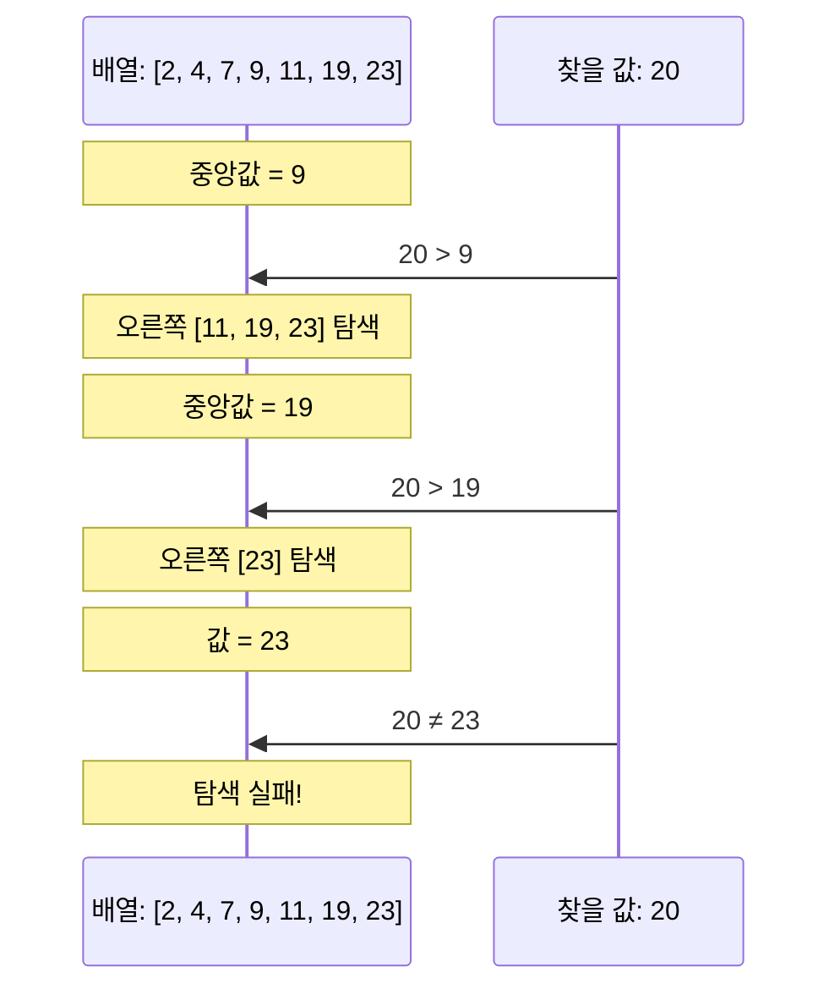

## 이진검색 (Binary Search)


### 정의

- 자료의 가운데에 있는 항목의 키 값과 비교하여
  다음 검색의 위치를 결정하고 검색을 계속 진행하는 방법
- 목적 키를 찾을 때까지 이진 검색을 순환적으로 반복 수행함으로써
  검색 범위를 반으로 줄여가면서 보다 빠르게 검색을 수행한다.


### 과정

1. 자료의 중앙에 있는 원소를 고른다
2. 중앙 원소의 값과 찾고자 하는 목표 값을 비교한다
3. 목표 값이 중앙 원소의 값보다 작으면
   자료의 왼쪽 반에 대해서 새로 검색을 수행하고
   크다면 자료의 오른쪽 반에 대해서 새로 검색을 수행
4. 찾고자 하는 값을 찾을 때까지 1-3의 과정을 반복

** **단, 이진 검색을 하기 위해서는 자료가 정렬된 상태여야 한다.**


### 예시




### 코드

1. 반복 구조

   ```python
   ```

   

2. 재귀 구조

   ```python
   ```

   