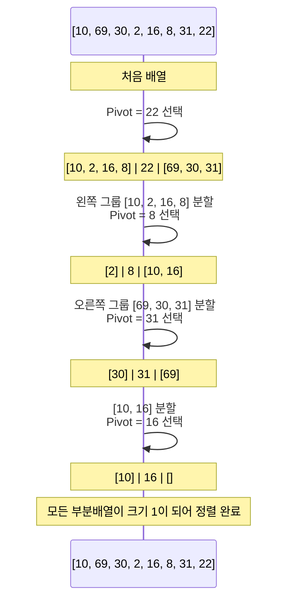
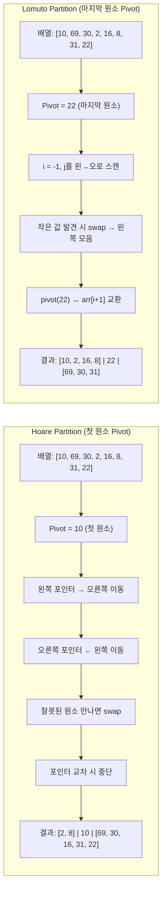
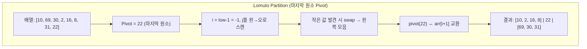
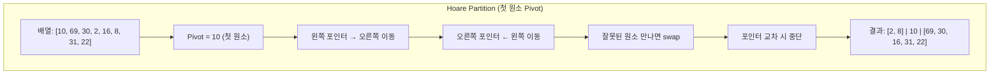
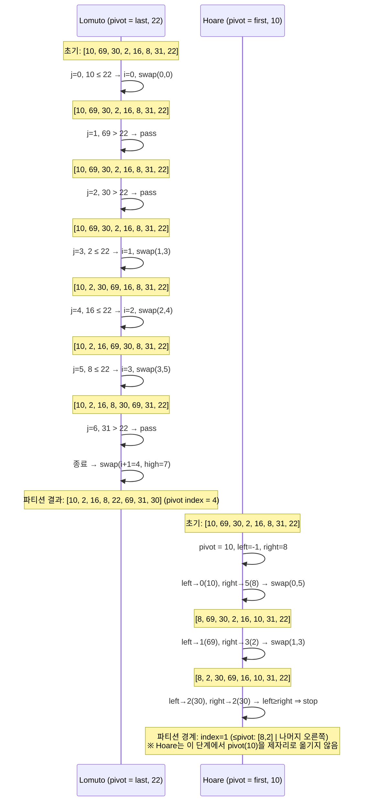

## 퀵 정렬 (Quick Sort)


#### 정의

기준값을 중심으로 주어진 배열을 두 개로 분할하고,
각각을 정렬하여 전체 배열을 정렬하는 방식


#### 병합 정렬과 퀵 정렬의 차이

| 구분      | 병합 정렬                               | 퀵 정렬                                                      |
| --------- | --------------------------------------- | ------------------------------------------------------------ |
| 분할 기준 | 단순히 배열을 반으로 나눔               | 기준 아이템(pivot item)을 중심으로, <br />기준보다 작은 것은 왼편, <br />큰 것은 오른편에 위치시킴 |
| 병합 처리 | 정렬된 부분을 다시 병합하는 과정이 필요 | 별도의 병합 과정 불필요                                      |


#### 시간 복잡도

- 평균 시간복잡도 O(nlogn)

- partitioning이라는 과정을 반복하면서,
  빠른 속도로 정렬이 된다!!


#### Partitioning

1. 작업 영역을 정한다.

2. 작업 영역 중 가장 왼쪽에 있는 수를 pivot이라고 하자.
   (Pivot을 "기준"으로 해석한다.)

   ** Pivot은 중간값, 우측 끝 값으로 설정해도 상관없지만, 
   우리는 왼쪽 끝 값을 기준으로 한다.

3. pivot을 기준으로

   - 왼쪽에는 Pivot보다 작은 수를 배치한다(정렬 안됨)
   - 오른쪽에는 Pivot보다 큰 수를 배치한다(정렬 안됨)


전체 과정을 미리 한 번 보면...



참고로,

- 각 파티셔닝이 끝나고 Pivot의 위치는 확정됩니다.
- 즉, 정렬이 다 되었을 때도 Pivot의 위치는 지금 위치 그대로 배정됩니다.


전체 배열을 정렬하기 위해서는, 파티셔닝이 반복적으로 이루어지는데요.

- 한 번의 파티셔닝 이후, 왼쪽과 오른쪽 부분 배열에 대해 재귀적으로 파티셔닝을 반복하여 정렬을 진행합니다.
  1. 작업 영역 지정
  2. Pivot 결정
  3. Pivot을 기준으로 배치 변경
  4. 파티셔닝의 마무리에서 해당 Pivot의 위치는 fix


#### Lomuto 파티션












#### 코드

1. Lomuto Partition - 주로 마지막 원소를 피벗으로

   재귀 호출을 관리하는 `quick_sort` 함수와, 실제 분할을 담당하는 `partition` 함수로 나누어 구현

   ```python
   def partition(arr, start, end):
       """
       분할(Partition)을 담당하는 실무자 함수.
       - 가장 오른쪽 원소(arr[end])를 피벗으로 설정.
       - 피벗보다 작은 값들은 왼쪽으로, 큰 값들은 오른쪽으로 재배치.
       - 최종적으로 피벗이 있어야 할 올바른 위치의 인덱스를 반환.
       """
       # 피벗을 가장 오른쪽 원소로 설정
       pivot = arr[end]
       # 피벗보다 작은 원소들을 저장할 경계 인덱스 i
       i = start - 1
   
       # start부터 end-1까지 순회
       for j in range(start, end):
           # 현재 원소가 피벗보다 작으면,
           if arr[j] < pivot:
               # 작은 원소 그룹의 경계를 한 칸 오른쪽으로 이동
               i += 1
               # 경계(i)와 현재 원소(j)의 위치를 교환하여, 작은 원소를 왼쪽으로 보냄
               arr[i], arr[j] = arr[j], arr[i]
   
       # 모든 순회가 끝나면, i+1 위치가 피벗이 들어갈 자리.
       # 피벗(arr[end])과 경계 다음 위치(arr[i+1])의 값을 교환
       arr[i + 1], arr[end] = arr[end], arr[i + 1]
   
       # 피벗의 최종 위치 인덱스를 반환
       return i + 1
   
   
   def quick_sort(arr, start, end):
       """
       퀵 정렬을 재귀적으로 지시하는 '매니저' 함수.
       """
       # 기저 조건: 정렬할 범위에 원소가 1개 이하일 때 (start >= end)
       if start < end:
           # 1. 분할: partition 함수를 호출하여 피벗의 최종 위치를 찾음
           pivot_idx = partition(arr, start, end)
   
           # 2. 정복 (재귀 호출)
           # 피벗을 기준으로 나뉜 왼쪽 부분을 재귀적으로 정렬
           quick_sort(arr, start, pivot_idx - 1)
           # 피벗을 기준으로 나뉜 오른쪽 부분을 재귀적으로 정렬
           quick_sort(arr, pivot_idx + 1, end)
   
   
   # --- 실행 코드 ---
   data_list = [3, 2, 4, 6, 9, 1, 8, 7, 5]
   print(f"정렬 전: {data_list}")
   
   quick_sort(data_list, 0, len(data_list) - 1)
   print(f"정렬 후: {data_list}")
   
   ```

   출력

   ```txt
   정렬 전: [3, 2, 4, 6, 9, 1, 8, 7, 5]
   정렬 후: [1, 2, 3, 4, 5, 6, 7, 8, 9]
   ```

   

2. Hoare-Partitioning - 주로 첫 번째 원소를 마지막으로

   ```python
   def partition_hoare(arr, start, end):
       """
       Hoare 파티션 방식
       - arr[start]를 피벗으로 사용
       - left, right 포인터가 교차할 때까지 값을 교환
       """
       pivot = arr[start]
       left = start + 1
       right = end
   
       while True:
           # left 포인터 이동: 피벗보다 큰 값을 찾을 때까지
           while left <= end and arr[left] < pivot:
               left += 1
   
           # right 포인터 이동: 피벗보다 작은 값을 찾을 때까지
           while left <= right and arr[right] > pivot:
               right -= 1
   
           # 포인터가 교차했다면 반복 종료
           if left > right:
               break
   
           # 교차 전이면 두 값의 위치를 교환
           arr[left], arr[right] = arr[right], arr[left]
   
       # 마지막으로 피벗과 right 포인터가 가리키는 값을 교환
       arr[start], arr[right] = arr[right], arr[start]
   
       # 피벗의 최종 위치인 right를 반환
       return right
   
   
   def quick_sort_hoare(arr, start, end):
       if start < end:
           pivot_idx = partition_hoare(arr, start, end)
   
           # Hoare 파티션은 피벗의 왼쪽/오른쪽을 모두 포함하여 재귀 호출
           # (피벗이 최종 위치에 있다는 보장이 없기 때문)
           quick_sort_hoare(arr, start, pivot_idx - 1)
           quick_sort_hoare(arr, pivot_idx + 1, end)
   
   
   # --- 실행 코드 ---
   data_list = [3, 2, 4, 6, 9, 1, 8, 7, 5]
   print(f"정렬 전: {data_list}")
   
   quick_sort_hoare(data_list, 0, len(data_list) - 1)
   print(f"정렬 후: {data_list}")
   
   ```

   출력

   ```txt
   정렬 전: [3, 2, 4, 6, 9, 1, 8, 7, 5]
   정렬 후: [1, 2, 3, 4, 5, 6, 7, 8, 9]
   ```

   