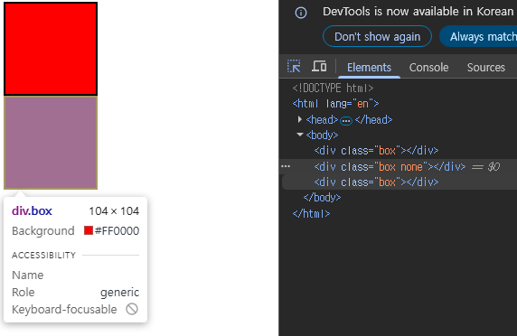

# CSS LAYOUT

<다루는 내용>

1. CSS Box Model
   1. display 속성(박스의 화면 배치 방식)
   2. Normal flow
   3. 기타 display 속성
2. CSS position
   1. Position 유형
   2. z - index
3. CSS Flexbox
   1. Flexbox 구성 요소
   2. Flexbox 속성
   3. flex-wrap 응용
4. 참고
   1. 마진 상쇄
   2. 박스 타입 별 수평 정렬
   3. 실제 Position 활용 예시
   4. Flexbox Shorthand 속성
   5. Flexbox 속성 정리


---


## 1. **CSS Box Model**

1. **display 속성(박스의 화면 배치 방식)**

   - 박스 타입에 따라 페이지에서의 배치 흐름 / 다른 박스와 관련하여 박스가 동작하는 방식이 달라지는데,

   - 박스 타입에는 Block 타입과 Inline 타입이 있다.

     

     - **Block 타입**은 하나의 독립된 덩어리처럼 동작하는 요소로, 웹 페이지의 큰 구조와 단락을 만든다.

       ```css
       .index {
           display : block;
       }
       ```

       **block 타입은 항상 새로운 줄에서 시작**하며, 가로 폭을 부모 컨테이너의 100%를 차지하는 성질이 있다. 즉, 옆에 다른 요소가 올 수 없고 자기 혼자 한 줄을 다 차지한다.
       때문에, `width`, `height`, `margin`, `padding` 같은  레이아웃 관련 속성을 모두 사용할 수 있다.
       `padding`, `margin`, `border` 값을 주면 다른 요소들과의 간격이 벌어지고, 상자 형태로 밀려난다.

       `width` 속성을 지정하지 않았을 때는, 위에서 말했듯이, 기본적으로 부모 컨테이너의 가로 폭을 전부(100%) 차지한다. 사용 가능한 가로 공간을 모두 먹는 셈이다.

       참고로 `width` 속성을 지정했을 때도, 여전히 block 성질을 유지하므로 <u>새로운 줄에서 시작</u>하고, 나머지 가로 공간은 비어 있더라도 다른 요소가 옆에 올 수 없다. 차지하는 공간만 지정된 크기만큼이 될 뿐

       *(그렇다면, 자연스러운 의문이 들 수 있다 : <u>`width`왜 써?</u>,,, 왜냐하면,,,* 

       1. *<u>여백 공간 활용</u> : 차지하는 가로폭을 줄인다면, 오른쪽 "여백공간"을 활용하여 <u>중앙 정렬</u>`margin: auto`이나 다양한 <u>레이아웃 배치</u>를 할 수 잇다.*
       2. *<u>콘텐츠 영역 제어</u> : 카드형 UI 처럼, 텍스트나 이미지가 정해진 가로 범위 안에서만 표시되고, 필요하면 자동 줄바꿈이 일어나도록 설계할 수  있다.*
       3. *<u>레이아웃 시스템과의 결합</u> : 다른 CSS 속성과 결합할 때 필요하다.`float`, `flex`, `grid`같은 레이아웃 시스템을 적용할 때 block 요소의 폭을 제한해야 여러 요소를 나란히 배치 가능하다.)*


       **대표적인 block 태그는 아래와 같다.**

       ```markdown
       제목 태그: <h1> ~ <h6>
       단락 태그: <p>
       구획 태그: <div>
       목록 태그: <ul>, <li>
       ```


       그 중에서 특히 `div`를 보자면,
       **div는 다른 HTML 요소들을 그룹화하여 레이아웃을 구성하거나 스타일링을 적용할 수 있다**
       헤더, 푸터, 사이드바 등 웹 페이지의 다양한 섹션을 구조화하는 데 있어 가장 많이 사용되는 요소이다. 

       ```html
       <div class="container">
       	<h1>제목</h1>
       	<p>단락 내용입니다.</p>
       </div>
       <div>
       	<p>콘텐츠</p>
       </div>
       ```

       

     - **Inline 타입**은 문장 안의 단어처럼 흐름에 따라 자연스럽게 배치되는 요소이다.
       줄을 바꾸지 않고, 텍스트의 일부에만 다른 스타일을 적용할 때 사용한다.

       ```css
       .index {
           display: inline;
       }
       ```

       **inline 타입은 줄바꿈이 일어나지 않고, 콘텐츠(글자·이미지)의 크기만큼만 영역을 차지한다.**
       그래서, block과 달리, 한 줄 안에서 다른 요소와 나란히 놓일 수 있다.

       이러한 inline요소는 `width`, `height` 속성을 사용할 수 없다
       (콘텐츠 크기에 맞춰 자동으로 영역이 지정된다).

       그리고, `padding`, `margin`, `border`의 경우, 수직 방향과 수평 방향에서 차이가 있다.

       - 수직 방향의 경우 

         `padding`, `margin`, `border`를 줘도 다른 요소를 위·아래로 밀어낼 수 없다. 즉, 줄 간격(line-height)에 영향을 줄 수는 있지만, block처럼 위아래 배치 공간을 밀어내진 못한다.
         (수직 방향 padding/margin은 레이아웃에 영향을 거의 주지 못한다)

       - 수평 방향의 경우
         `padding`, `margin`, `border`가 정상적으로 적용되어 옆의 inline 요소들을 밀어낼 수 있다.


       대표적인 Inline 태그는 아래와 같다.
       ```markdown
       <a>: 하이퍼링크
       : 이미지
       <span>: 특정 텍스트 구간을 묶는 용도
       <strong>: 강조(굵게 표시)
       ```


       그 중에서 특히 `span`을 볼게요.

       span의 특징은

       1. 자체적인 시각적 변화가 없다
          (스타일을 적용하기 전까지는 특별한 변화 없음)
       2. 문단(`<p>`) 안에서 특정 단어나 구문에만 스타일을 적용하고 싶을 때 유용하다. 
          예: 글자 색상 변경, 밑줄, 배경색 강조 등
       3. 블록 요소처럼 줄바꿈을 일으키지 않으므로, 문서의 구조에 큰 변화를 주지 않는다. 
          이에, 문서의 구조를 바꾸지 않고, <u>스타일링이나 JavaScript 조작을 위해 작은 단위를 선택할 때</u> 주로 사용한다.


       ```html
       <p>이 문장에서 <span style="color: blue;">파란색</span> 단어만 색상이 다릅니다.</p>
       <p>이 단어는 <span class="highlight-text">강조</span>되었습니다.</p>
       <p>이것은 <span id="changeText">클릭</span>하면 변경됩니다.</p>
       ```

       첫 번째 문장 → “파란색”이라는 단어만 글자 색이 파란색으로 변경

       두 번째 문장 → “강조”라는 단어만 클래스 스타일을 적용받아 강조

       세 번째 문장 → “클릭”이라는 단어에 id를 달아둬서, JavaScript로 이벤트 연결 가능

       

2. **Normal flow**
   Normal flow 란, 기본 배치 규칙, 즉 특별히 `float`, `position`, `flex`, `grid` 같은 레이아웃 속성을 사용하지 않았을 때, 웹 페이지 요소들이 기본적으로 배치되는 방식이다.

3. **기타 display 속성**

   1. **inline - block**
      inline과 blcok의 특징을 모두 가진 특별한 display 속성 값이다.

      ```css
      .index {
          display: inline-block;
      }
      ```

      1. inline처럼 줄바꿈을 하지 않고 옆에 나란히 배치 가능하며

      2. block처럼 `width`, `height`, `margin`, `padding`을 자유롭게 적용 가능하다.

      주로 가로로 정렬된 내비게이션 메뉴나 여러 개의 버튼, 이미지 갤러리처럼 수평으로 나열하면서, 각 항목의 크기는 직접 제어하고 싶을 때 매우 유용하게 사용된다.

      예시 코드는 `03-span.html` 참고

      예시 코드의 결과 이미지
      

   2. **none**
      none 타입은 요소를 화면에 표시하지 않고, 공간조차 부여되지 않는다.

      ```css
      .index {
      	display: none;
      }
      ```

      < 예시코드 : `03-span.html` 참고 >
      < 예시 이미지 > 

      ```markdown
      설명
      - `.box` 클래스는 빨간 정사각형(100px × 100px) 박스를 생성
      - 두 번째 `<div>`에는 `class="box none"`이 적용되어 있어서, `display: none;`이 동작
      
      ➡ 즉, 두 번째 박스는 **화면에 아예 표시되지 않음**
      
      - 자리 차지 X
      - 여백도 남지 않음
      
      그래서 브라우저에 보이는 건 **위아래 두 개의 빨간 박스**뿐
      ```

      참고로, `display :none;`과 비교되는 것이, `visibility: hidden;`이 있는데
      얘는 요소는 안 보이지만 공간은 유지되기 때문에, 공간조차 차지 않는 `display: none;`과는 차이가 있다.

   3. **flex**
      (후술)

## 2. CSS position

지금까지는 CSS Layout을 중점적으로 다뤄봤다.


CSS Layout이 

1. 이 각 요소의 위치와 크기를 저장하여 웹 페이지의 디자인을 결정하는 것
2. 요소들을 상하좌우로 정렬하고, 간격을 맞추고, 전체적인 페이지의 뼈대를 구성하는 것으로,
3. `display(block, inline, flex, grid, ...)`의 핵심 속성이 있었다면


CSS Position은 

1. 요소를 NORMAL Flow에서 제거하여 다른 위치로 배치하는 것으로,
2. 다른 요소 위에 올리기, 화면의 특정 위치에 고정시키기 등이 해당한다.
3. 핵심속성으로는 `position(static, relative, absolute, fixed, sticky, ...)` 등이 있다.


position을 이해하기 위해서는, 우선 이동방향에 대해서 이해해야 하는데,

CSS에서 요소의 위치를 제어할 때는 **4가지 방향 속성**과 **쌓임 순서(z-index)**를 사용할 수 있다.


4가지 방향 속성에는 왼쪽 / 오른쪽 / 위쪽 / 아래쪽이 있겠고,

- `top` : 요소를 위쪽으로부터 얼마나 떨어뜨릴지 지정
- `bottom` : 요소를 아래쪽으로부터 얼마나 떨어뜨릴지 지정
- `left` : 요소를 왼쪽으로부터 얼마나 떨어뜨릴지 지정
- `right` : 요소를 오른쪽으로부터 얼마나 떨어뜨릴지 지정


쌓임 순서는 Z-축으로 표시하는데, 모니터에서 우리 얼굴 방향으로 뻗어나간다고 생각하면 된다.

즉, 평면적인 화면에서 요소들이 겹쳐질 때, **어느 요소가 위에 올지**를 결정하는 것이고,
 `z-index`값이 클 수록 위쪽(우리 얼굴 쪽)에 표시된다. 
참고로, 기본값은 `auto`로, 요소가 HTML에 등장한 순서대로 쌓인다.


1. **Position 유형**

   1. **static**

      static은 기본값이다. 즉, 아무 설정도 하지 않은 모든 요소는 `static`이다.

      ```css
      .static {
          position : static;
          background-color: lightcoral;
      }
      ```

      요소는 <u>Normal Flow에 따라 배치</u>되기에 
      `block`이라면 위에서 아래로, `inline`이라면 왼쪽에서 오른쪽으로 쌓이고,
      `top`, `right`, `bottom`, `left` 같은 위치 조정 속성이 적용되지 않는다.

      전체 코드는 `03-css-layout-position/01-position.html`을 참고하면 되고, 결과 이미지는 아래와 같다. 

      

   2. **relative**

      relatvie 요소는 기본적으로 Normal Flow에 따라 배치되나, 자기 자리에서 상대적으로 움직일 수 있다.

      즉, 자신의 원래 위치를 기준으로  `top`, `right`, `bottom`, `left` 속성을 적용해 이동할 수 있는 것!

      

      위의 이미지에서 보실 수 있다싶이, relative는 다른 요소에 영향을 주지는 않는다.
      relative로 이동해도, 그 요소가 차지하는 공간은 여전히 **static일 때의 공간과 동일**하기 때문이다.

      그래서, relative은 레이아웃을 보존하고 싶을 때, 즉, 해당 요소의 '겉보기 위치'를 조정하고 싶을 때 자주 쓰인다.

      ```css
      .relative {
          position: relative;
          background-color: lightblue;
          top: 75px;  /*원래 위치에서 아래로 75px 이동*/
          left: 75px; /*원래 위치에서 오른쪽으로 75px 이동*/
      }
      ```

      *우리가 아직 absolute를 학습하지 않았기 때문에,* 
      *여기서 자연스러운 의문이 들 수 있는데,
      그 의문과 그에 대한 gpt의 응답은 markdown 블럭에 적어두겠습니다.*

      ```markdown
      `이미지에서 보기에 code 순서가 static - absolute - relative 순서인데,` 
      `왜 relative 박스가 Absolute 밑이 아니라 Relative 바로 밑의 위치에서 '아래로 75px, 오른쪽으로 75px 이동한' 것 처럼 보이지?`
      
       순서대로라면:
      Static → 맨 위
      Absolute → 그 아래
      Relative → 그 아래
      이게 Normal Flow일 때의 기본 배치예요.
       
       그런데, 왜 Absolute 밑이 아니라 Relative 밑에서 보이나?
      -> Absolute 박스는 Normal Flow에서 빠져버린 상태라서, 실제 레이아웃 공간을 차지하지 않아요.
      따라서 Static → Relative → (그 자리에 Absolute가 겹쳐져 보이는) 이런 구조가 됩니다.
      
      즉:
      HTML 순서상으로 Relative는 Static 바로 다음에 배치
      Absolute는 Flow에서 빠졌으므로 Relative의 “자리 배치”에 간섭하지 않음
      따라서 Relative는 Static 밑에 원래 자리 잡고, 거기서부터 top: 75px, left: 75px만큼 이동해 보이는 것
       
      relative는 원래 위치를 기준으로 이동한다.
      absolute는 Flow에서 빠지므로 다른 요소의 배치에는 영향을 주지 않는다.
      그래서 Relative는 “원래 자리를 유지한 채 이동한 것처럼 보인다.”
      → 따라서 “static → relative 순서”가 맞고, 설명도 일관성이 있어요.
      ```

      

   3. **absolute**

      absolute는 요소를 **Normal Flow에서 제거**한다.

      → 즉, 문서 내에서 차지하는 공간이 없어지고, 다른 요소들의 배치에도 영향을 주지 않는다.

      가장 가까운 relative 부모 요소를 기준으로 이동하는데,
      만족하는 부모 요소가 없다면, body 태그를 기준으로 이동한다.

      `top`, `right`, `bottom`, `left` 속성으로 위치를 조정할 수 있다

      * 참고 : CSS의 `top`, `right`, `bottom`, `left` 속성은 요소의 위치를 이동시킬 때 쓰는데, 
        각각의 의미는 “해당 방향에서부터 요소까지의 거리”

        

      absolute 관련해서 코드를 하나 더 보여드리자면,

      `03-css-layout-position/03-absolute.html`

      

      이건 카드 UI 레이아웃 안에서 **relative + absolute**를 조합해서
       뱃지(`New`)를 오른쪽 상단에 붙이는 전형적인 패턴인데, 

      1. `.card`(부모박스)는 300px × 200px 크기 카드를 만들어서, 
         자식 absolute 요소들 위치의 기준점이 되어준다.

      2. `.card-content`(내용영역)는 화면에서 파란 부분으로,  카드 내부의 본문 (제목, 설명)이다. 
         즉, 카드 안에 텍스트는 넣는 영역이라, `padding: 10px`(카드 안쪽 여백)을 준 것을 볼 수 있다.

      3. `.badge`는 화면에서 빨간색 버튼으로,
          카드 오른쪽 상단에 고정된 것을 확인할 수 있는데, 그 작동 원리는 아래와 같다. 

         1. `position: absolute`이기 때문에, Normal Flow에서는 빠진다.

         2. 부모박스인 .card를 기준으로 `top: 0; right: 0;`(오른쪽 상단)에 위치한다.

         3. `padding: 5px 10px`(내부 여백)을 준다. 
            *** 참고 : 

            ```css
            /* padding 값 개수별 사용법 */
            
            /* 1개 값 → 상·우·하·좌 모두 동일 */
            padding: 10px;        /* 상=10px, 우=10px, 하=10px, 좌=10px */
            
            /* 2개 값 → 상·하 / 좌·우 */
            padding: 5px 10px;    /* 상=5px, 하=5px / 좌=10px, 우=10px */
            
            /* 3개 값 → 상 / 좌·우 / 하 */
            padding: 5px 10px 20px;  /* 상=5px / 좌=10px, 우=10px / 하=20px */
            
            /* 4개 값 → 상 / 우 / 하 / 좌 (시계 방향) */
            padding: 5px 10px 15px 20px;  /* 상=5px, 우=10px, 하=15px, 좌=20px */
            
            ```

            

   4. **fixed**

      fixed 또한 요소를 Normal Flow에서 제거한다.

      -> 즉, 문서에서 요소가 차지하는 공간이 없어지고, 다른 요소들의 배치에도 영향을 주지 않는다.

      현재 화면 영역(viewport)을 기준으로 이동하는데, 스크롤해도 항상 같은 위치에 유지된다.
      그래서, `내비게이션 바`, `상단/하단 고정 배너`, `맨 위로 가기 버튼` 등에 자주 사용된다.

      마찬가지로, `top`, `right`, `bottom`, `left` 속성으로 위치를 조정할 수 있다
      예: `top: 0; right: 0;` → 화면 오른쪽 상단에 고정

      

      fixed까지 모두 이해한 시점에서 이제 다시 우리의 그림을 보면 

      아래와 같이 정리할 수 있다.

      ```markdown
      빨간 박스(static) → normal flow 그대로
      
      초록 박스(absolute) → 부모(container)의 기준점에서 top:100px, left:100px 위치로 이동, **원래 공간은 사라짐**
      
      파란 박스(relative) → 자기 자리(top:100px)에서 top(75)/left(75) 만큼 이동했지만, **원래 공간(top:100px)은 유지됨**
      
      회색 박스(fixed) → Flow와 무관하게, 화면 전체 기준으로 고정
      ```

      

   5. **sticky**

      sticky는 `relative`와 `fixed`의 특성을 결합한 속성으로,
      스크롤 위치에 따라 동작이 달라진다.

      

      즉, 스크롤의 위치에 따라 아래의 세 가지 동작 중에 어떠한 동작을 하는지가 달라진다.

      **relative처럼 동작**

      - 처음에는 Normal Flow에 따라 배치된다(즉, 자기 자리 차지).
      - 스크롤이 해당 요소의 영역에 도달하기 전까지는 일반적인 relative와 같다.

      **fixed처럼 동작**

      - 스크롤이 요소의 <u>임계점</u>(threshold, 보통 `top`, `left` 등으로 지정)<u>에 도달하면 화면에 고정</u>된다.
      - 즉, 그 순간부터는 `fixed`처럼 <u>viewport에 붙어서 움직이지 않음</u>.

      **자리 대체**

      - 다음 sticky 요소가 등장하면, 이전 sticky는 그 자리를 내주고 다시 Normal Flow로 돌아간다.

        

      코드는 `03-css-layout-position/02.sticky.html`을 참고하면 된다.

      결과 이미지로 보면,
      

      

      **스크롤 전**(두번째, 세번재 sticky 해당) → sticky 박스는 원래 자기 자리에서 relative처럼 보임.

      **스크롤 후(top:0에 닿음)**(첫번째 sticky 해당) → 화면 상단에 붙어서 fixed처럼 고정됨.

      **다음 sticky가 나오면** → 이전 sticky는 제자리로 돌아가고, 새로운 sticky가 화면 상단에 고정됨.

      


      예상할 수 있겠지만, 이러한 sticky는 주로 `섹션별 제목 고정`등으로 활용된다.

      

2. **z - index**
   z-index는 위에서 살짝 언급했다싶이,
   요소의 쌓임 순서를 정의하는 속성이다.

   ```css
   .index {
       z-index: 1;
   }
   ```

   특징으로는,,

   1. 정수 값을 사용하며, 값이 클수록 위에 쌓인다.
      (예: `z-index: 10;`은 `z-index: 1;`보다 화면 위쪽에 표시)

      - 참고로, 음수 `z-index`값은 요소를 부모 요소의 뒤(배경)로 보낼 때 사용할 수 있다.

   2. **position 속성이 static이 아닌 요소에만 적용된다**

      - 즉, `position: relative`, `absolute`, `fixed`, `sticky` 같은 속성이 있어야 한다.
      - `position: static`(기본값)인 경우 `z-index`를 줘도 무시된다.
      - **기본값은 `auto`**로, 부모 요소의 `z-index` 값에 영향을 받는다.
        - 부모의 `z-index`값이 낮다면, 자식의 `z-index`가 아무리 높아도 부모보다 위로 올라갈 수 없다.
      - **같은 부모 안에서만 `z-index` 값을 비교하는데, **
        - 기본적으로 값이 큰 요소가 위로 올라오고,
        - 값이 같다면 HTML 작성 순서(나중에 나온 요소)가 위로 올라온다.


      이제 코드로 봐보자.

      `03-css-layout-position/04-z-index.html` 확인하면 된다.

      

## 3. CSS Flexbox

CSS Flexbox는 요소를 행과 열 형태로 배치하는 1차원 레이아웃 방식이다.

```css
.container {
    display: flex;
}
```


1. Flexbox 구성 요소
2. Flexbox 속성
3. flex-wrap 응용

## 4.참고

1. 마진 상쇄
2. 박스 타입 별 수평 정렬
3. 실제 Position 활용 예시
4. Flexbox Shorthand 속성
5. Flexbox 속성 정리


content : 여러줄

items: 1줄

self : 1개


flex 박스는 부모가 컨트롤 한다는 것을 꼭 기억하세요!

이제 레이아웃은 어떠한 부모를 크게 잡는 게 중요합니다.

큰 부모를 그리시고, 거기서 어떻게 작은 박스를 배치할 지 생각해보시면 됩니다!

