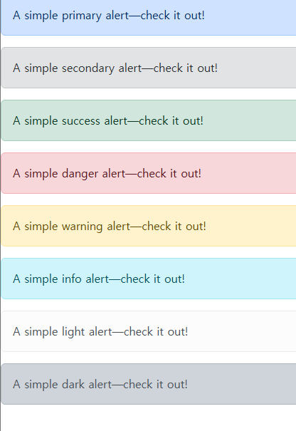

# Reset CSS

Bootstrap은 Reset CSS를 통해 기존의 스타일을 삭제함.


원래도 

우리는 h1 태그를 썼을 뿐인데, font-size, style 이런 스타일이 들어가있어요.

각각의 html요소들은 css의 기본 스타일이 입혀져있다는 거에요.


그런데, 이 기본 스타일들을 왜 없애느냐.


Reset CSS : 모든 HTML 요소 스타일을 일관된 기준으로 재설정하는 간결하고 압축된 규칙 시트

HTML Element, Table, List 등의 요소들에 일관성 있게 스타일을 적용 시키는 기본 단계


Reset CSS 사용 배경

- 모든 브라우저는 각각의 'user agent stylesheet'를 가지고 있음
  - 웹사이트를 보다 읽기 편하게 하기 위해
- 문제는 이 설정이 브라우저(엣지, 사파리, 크롬, 파이어폭스 등등)마다 상이하다는 것
  - *-> 프론트엔드 개발의 파멸의 시작*
- 모든 브라우저에서 웹사이트를 동일하게 보이게 만들어야 하는 개발자에겐 매우 골치 아픈 일
- 모두 똑같은 스타일 상태로 만들고 스타일 개발을 시작하자!
  - *-> 스타트 지점을 맞추자 ^0^*


reset css 하는 방법이 여러 가지가 있거든요

그 중에 하나 Normalize CSS

얘가 가장 대중적인 방법이에요.

왜냐.

일단 모두를 웹 표준 기준으로 맞춰요.

브라우저 중에 표준에 대한 기능을 지원하지 않는 애가 있다면, 그 브라우저에게 나머지 애들을 맞춰요

그래서 살짝 유연한 친구에요.

-Normalize CSS

- Reset CSS 방법 중 대표적인 방법
- 웹 표준 기준으로 브라우저 중 하나가 불일치 한다면 차이가 있는 브라우저를 수정하는 방법
  - 경우에 따라 IE 또는 EDGE 브라우저는 표준에 따라 수정할 수 없는 경우도 있는데,
  - 이 경우 IE 또는 EDGE의 스타일을 나머지 브라우저에 적용시킴

Bootstrap은 `bootstrap-reboot.css`라는 파일명으로 normalize.css를 자체적으로 커스텀해서 사용하고 있음


# [Typography](https://getbootstrap.com/docs/5.3/content/typography/)

```html
<!DOCTYPE html>
<html lang="en">
<head>
  <meta charset="UTF-8">
  <meta name="viewport" content="width=device-width, initial-scale=1.0">
  <title>Najung Site</title>
  <link href="https://cdn.jsdelivr.net/npm/bootstrap@5.3.8/dist/css/bootstrap.min.css" rel="stylesheet" integrity="sha384-sRIl4kxILFvY47J16cr9ZwB07vP4J8+LH7qKQnuqkuIAvNWLzeN8tE5YBujZqJLB" crossorigin="anonymous">
  <!--확장자임을 참고, 웹상의 주소에서 css 및 js 파일을 가져오는 것.-->
</head>
<body>
  <p>바디에 쓴 것만 눈에 보입니다</p>
  <p>Bootstrap heading</p>
  <!-- <script src="https://cdn.jsdelivr.net/npm/bootstrap@5.3.8/dist/js/bootstrap.bundle.min.js" integrity="sha384-FKyoEForCGlyvwx9Hj09JcYn3nv7wiPVlz7YYwJrWVcXK/BmnVDxM+D2scQbITxI" crossorigin="anonymous"></script> -->
  <!-- heading -->
  <h1>h1. Bootstrap heading</h1>
  <h2>h2. Bootstrap heading</h2>
  <h3>h3. Bootstrap heading</h3>
  <h4>h4. Bootstrap heading</h4>
  <h5>h5. Bootstrap heading</h5>
  <h6>h6. Bootstrap heading</h6>

  <!-- p태그로도 헤딩을 쓸 수 있다 -->
  <p class="h1">h1. Bootstrap heading</p>
  <p class="h2">h2. Bootstrap heading</p>
  <p class="h3">h3. Bootstrap heading</p>
  <p class="h4">h4. Bootstrap heading</p>
  <p class="h5">h5. Bootstrap heading</p>
  <p class="h6">h6. Bootstrap heading</p>

  <!-- display heading -->
   <!-- 전통적인 제목 요소는 페이지 콘텐츠의 고기에서 가장 잘 작동하도록 설계되었습니다. 
    눈에 띄기 위해 제목이 필요할 때는 디스플레이 제목—
    더 크고 약간 더 의견이 분분한 제목 스타일을 사용하는 것을 고려해 보세요. -->
  <h1 class="display-1">Display 1</h1>
  <h1 class="display-2">Display 2</h1>
  <h1 class="display-3">Display 3</h1>
  <h1 class="display-4">Display 4</h1>
  <h1 class="display-5">Display 5</h1>
  <h1 class="display-6">Display 6</h1>

  <!-- inline text -->
  <p>You can use the mark tag to <mark>highlight</mark> text.</p>
  <p><del>This line of text is meant to be treated as deleted text.</del></p>
  <p><s>This line of text is meant to be treated as no longer accurate.</s></p>
  <p><ins>This line of text is meant to be treated as an addition to the document.</ins></p>
  <p><u>This line of text will render as underlined.</u></p>
  <p><small>This line of text is meant to be treated as fine print.</small></p>
  <p><strong>This line rendered as bold text.</strong></p>
  <p><em>This line rendered as italicized text.</em></p>

  <!-- list -->

  <ul class="list-unstyled">  <!--list의 불릿 포인트를 제거하는 거구나.  -->
    <li>This is a list.</li>
    <li>It appears completely unstyled.</li>
    <li>Structurally, it’s still a list.</li>
    <li>However, this style only applies to immediate child elements.</li>
    <li>Nested lists:
      <ul>
        <li>are unaffected by this style</li>
        <li>will still show a bullet</li>
        <li>and have appropriate left margin</li>
      </ul>
    </li>
    <li>This may still come in handy in some situations.</li>
  </ul>


</body>
</html>
```


# Bootstrap Color System

- Bootstrap이 지정하고 제공하는 색상 시스템
- 일관성 있는 의미론점 관점의 색상을 적용할 수 있게 해 줌


```html
<!DOCTYPE html>
<html lang="en">

<head>
  <meta charset="UTF-8">
  <meta name="viewport" content="width=device-width, initial-scale=1.0">
  <title>Document</title>
  <link href="https://cdn.jsdelivr.net/npm/bootstrap@5.3.8/dist/css/bootstrap.min.css" rel="stylesheet"
    integrity="sha384-sRIl4kxILFvY47J16cr9ZwB07vP4J8+LH7qKQnuqkuIAvNWLzeN8tE5YBujZqJLB" crossorigin="anonymous">
</head>

<body>
  <!-- text colors -->
  <p class="text-primary">.text-primary</p>
  <p class="text-primary-emphasis">.text-primary-emphasis</p>
  <p class="text-secondary">.text-secondary</p>
  <p class="text-secondary-emphasis">.text-secondary-emphasis</p>
  <p class="text-success">.text-success</p>
  <p class="text-success-emphasis">.text-success-emphasis</p>
  <p class="text-danger">.text-danger</p>
  <p class="text-danger-emphasis">.text-danger-emphasis</p>
  <p class="text-warning bg-dark">.text-warning</p>
  <p class="text-warning-emphasis">.text-warning-emphasis</p>
  <p class="text-info bg-dark">.text-info</p>
  <p class="text-info-emphasis">.text-info-emphasis</p>
  <p class="text-light bg-dark">.text-light</p>
  <p class="text-light-emphasis">.text-light-emphasis</p>
  <p class="text-dark bg-white">.text-dark</p>
  <p class="text-dark-emphasis">.text-dark-emphasis</p>

  <p class="text-body">.text-body</p>
  <p class="text-body-emphasis">.text-body-emphasis</p>
  <p class="text-body-secondary">.text-body-secondary</p>
  <p class="text-body-tertiary">.text-body-tertiary</p>

  <p class="text-black bg-white">.text-black</p>
  <p class="text-white bg-dark">.text-white</p>
  <p class="text-black-50 bg-white">.text-black-50</p>
  <p class="text-white-50 bg-dark">.text-white-50</p>


  <!-- background colors -->
   <!-- div태그 이기 때문에 한 블락을 다 먹음 -->
    <!-- padding 3, margin bottom 2 이런식으로 해석도 해볼 수 있습니다. -->
  <div class="p-3 mb-2 bg-primary text-white">.bg-primary</div>
  <div class="p-3 mb-2 bg-primary-subtle text-primary-emphasis">.bg-primary-subtle</div>
  <div class="p-3 mb-2 bg-secondary text-white">.bg-secondary</div>
  <div class="p-3 mb-2 bg-secondary-subtle text-secondary-emphasis">.bg-secondary-subtle</div>
  <div class="p-3 mb-2 bg-success text-white">.bg-success</div>
  <div class="p-3 mb-2 bg-success-subtle text-success-emphasis">.bg-success-subtle</div>
  <div class="p-3 mb-2 bg-danger text-white">.bg-danger</div>
  <div class="p-3 mb-2 bg-danger-subtle text-danger-emphasis">.bg-danger-subtle</div>
  <div class="p-3 mb-2 bg-warning text-dark">.bg-warning</div>
  <div class="p-3 mb-2 bg-warning-subtle text-warning-emphasis">.bg-warning-subtle</div>
  <div class="p-3 mb-2 bg-info text-dark">.bg-info</div>
  <div class="p-3 mb-2 bg-info-subtle text-info-emphasis">.bg-info-subtle</div>
  <div class="p-3 mb-2 bg-light text-dark">.bg-light</div>
  <div class="p-3 mb-2 bg-light-subtle text-light-emphasis">.bg-light-subtle</div>
  <div class="p-3 mb-2 bg-dark text-white">.bg-dark</div>
  <div class="p-3 mb-2 bg-dark-subtle text-dark-emphasis">.bg-dark-subtle</div>
  <div class="p-3 mb-2 bg-body-secondary">.bg-body-secondary</div>
  <div class="p-3 mb-2 bg-body-tertiary">.bg-body-tertiary</div>
  <div class="p-3 mb-2 bg-body text-body">.bg-body</div>
  <div class="p-3 mb-2 bg-black text-white">.bg-black</div>
  <div class="p-3 mb-2 bg-white text-dark">.bg-white</div>
  <div class="p-3 mb-2 bg-transparent text-body">.bg-transparent</div>


  <script src="https://cdn.jsdelivr.net/npm/bootstrap@5.3.8/dist/js/bootstrap.bundle.min.js"
    integrity="sha384-FKyoEForCGlyvwx9Hj09JcYn3nv7wiPVlz7YYwJrWVcXK/BmnVDxM+D2scQbITxI"
    crossorigin="anonymous"></script>
</body>

</html>

```


# Component

가장 많이 쓰게 될 챕터

Bootstrap Component : Bootstrap에서 제공하는 UI 관련 요소

UI 관련 요소란 버튼, 네비게이션 바, 카드, 폼, 드랍다운 등을 의미합니다.


(이점) 일관된 디자인을 제공하여 웹 사이트의 구성요소를 구축하는 데 유용하게 활용

(대표 컴포넌트) Alerts, Badges, Cards, Navbars

(참고) components의 동작은 JavaScript를 활용해서 만들어집니다

만약 동작이 잘 되지 않을 경우, 다음을 확인해 봅시다.

​	Bootstrap의 <script> 요소가 잘 추가되어 있는지 확인합니다.

​	data-*로 시작하는 속성들이 잘 정의되어 있는지 확인합니다.



---

```html
# component
<!DOCTYPE html>
<html lang="en">

<head>
  <meta charset="UTF-8">
  <meta name="viewport" content="width=device-width, initial-scale=1.0">
  <title>Document</title>
  <link href="https://cdn.jsdelivr.net/npm/bootstrap@5.3.8/dist/css/bootstrap.min.css" rel="stylesheet"
    integrity="sha384-sRIl4kxILFvY47J16cr9ZwB07vP4J8+LH7qKQnuqkuIAvNWLzeN8tE5YBujZqJLB" crossorigin="anonymous">
</head>

<body>
  <!-- alerts -->
  <div class="alert alert-primary" role="alert">
    A simple primary alert—check it out!
  </div>
  <div class="alert alert-secondary" role="alert">
    A simple secondary alert—check it out!
  </div>
  <div class="alert alert-success" role="alert">
    A simple success alert—check it out!
  </div>
  <div class="alert alert-danger" role="alert">
    A simple danger alert—check it out!
  </div>
  <div class="alert alert-warning" role="alert">
    A simple warning alert—check it out!
  </div>
  <div class="alert alert-info" role="alert">
    A simple info alert—check it out!
  </div>
  <div class="alert alert-light" role="alert">
    A simple light alert—check it out!
  </div>
  <div class="alert alert-dark" role="alert">
    A simple dark alert—check it out!
  </div>

  <!-- badges -->
   <!-- span 태그라서 오른쪽으로 흐르는 것도 볼 수 있음 -->
  <div>배지</div>
  <span class="badge rounded-pill text-bg-primary">Primary</span>
  <span class="badge rounded-pill text-bg-secondary">Secondary</span>
  <span class="badge rounded-pill text-bg-success">Success</span>
  <span class="badge rounded-pill text-bg-danger">Danger</span>
  <span class="badge rounded-pill text-bg-warning">Warning</span>
  <span class="badge rounded-pill text-bg-info">Info</span>
  <span class="badge rounded-pill text-bg-light">Light</span>
  <span class="badge rounded-pill text-bg-dark">Dark</span>


  <!-- Buttons -->
  <div>버튼</div>
  <button type="button" class="btn">Base class</button>
  <button type="button" class="btn btn-primary">Primary</button>
  <button type="button" class="btn btn-secondary">Secondary</button>
  <button type="button" class="btn btn-success">Success</button>
  <button type="button" class="btn btn-danger">Danger</button>
  <button type="button" class="btn btn-warning">Warning</button>
  <button type="button" class="btn btn-info">Info</button>
  <button type="button" class="btn btn-light">Light</button>
  <button type="button" class="btn btn-dark">Dark</button>

  <button type="button" class="btn btn-link">Link</button>


  <!-- Cards -->
  <div>카드</div>
  <div class="card" style="width: 18rem;">
    
    <div class="card-body">
      <h5 class="card-title">Card title</h5>
      <p class="card-text">Some quick example text to build on the card title and make up the bulk of the card’s content.</p>
      <a href="#" class="btn btn-primary">Go somewhere</a>
    </div>
  </div>


  <!-- navbar -->

  <script src="https://cdn.jsdelivr.net/npm/bootstrap@5.3.8/dist/js/bootstrap.bundle.min.js"
    integrity="sha384-FKyoEForCGlyvwx9Hj09JcYn3nv7wiPVlz7YYwJrWVcXK/BmnVDxM+D2scQbITxI"
    crossorigin="anonymous"></script>
</body>

</html>

```


# caraousel

```html
<!DOCTYPE html>
<html lang="en">

<head>
  <meta charset="UTF-8">
  <meta name="viewport" content="width=device-width, initial-scale=1.0">
  <title>Document</title>
  <link href="https://cdn.jsdelivr.net/npm/bootstrap@5.3.8/dist/css/bootstrap.min.css" rel="stylesheet"
    integrity="sha384-sRIl4kxILFvY47J16cr9ZwB07vP4J8+LH7qKQnuqkuIAvNWLzeN8tE5YBujZqJLB" crossorigin="anonymous">
</head>

<body>
  <div class="container">
    <!-- carousel -->
     <div id="carouselExample" class="carousel slide">
      <div class="carousel-inner">
        <div class="carousel-item active">
          
        </div>
        <div class="carousel-item">
          
        </div>
        <div class="carousel-item">
          
        </div>
      </div>
      <button class="carousel-control-prev" type="button" data-bs-target="#carouselExample" data-bs-slide="prev">
        <span class="carousel-control-prev-icon" aria-hidden="true"></span>
        <span class="visually-hidden">Previous</span>
      </button>
      <button class="carousel-control-next" type="button" data-bs-target="#carouselExample" data-bs-slide="next">
        <span class="carousel-control-next-icon" aria-hidden="true"></span>
        <span class="visually-hidden">Next</span>
      </button>
    </div>


      <!-- carousel 2 -->
       <!-- 주의 : 오른쪽 버튼이 동작하지 않음 : 위에 것이 돌아감. -->
        <!-- 버튼을 눌렀을 때 어떤 캐로제를 가리킬 것인지에 대한 코드를 수정해주어야함. -->
         <!-- 바로 이 부분 data-bs-target="#carouselExample" -->
     <div id="carouselExample2" class="carousel slide">
      <div class="carousel-inner">
        <div class="carousel-item active">
          
        </div>
        <div class="carousel-item">
          
        </div>
        <div class="carousel-item">
          
        </div>
      </div>
      <button class="carousel-control-prev" type="button" data-bs-target="#carouselExample2" data-bs-slide="prev">
        <span class="carousel-control-prev-icon" aria-hidden="true"></span>
        <span class="visually-hidden">Previous</span>
      </button>
      <button class="carousel-control-next" type="button" data-bs-target="#carouselExample2" data-bs-slide="next">
        <span class="carousel-control-next-icon" aria-hidden="true"></span>
        <span class="visually-hidden">Next</span>
      </button>
    </div>

  </div>

  <script src="https://cdn.jsdelivr.net/npm/bootstrap@5.3.8/dist/js/bootstrap.bundle.min.js"
    integrity="sha384-FKyoEForCGlyvwx9Hj09JcYn3nv7wiPVlz7YYwJrWVcXK/BmnVDxM+D2scQbITxI"
    crossorigin="anonymous"></script>
</body>

</html>

```


# MODAL

```HTML
<!DOCTYPE html>
<html lang="en">

<head>
  <meta charset="UTF-8">
  <meta name="viewport" content="width=device-width, initial-scale=1.0">
  <title>Document</title>
  <link href="https://cdn.jsdelivr.net/npm/bootstrap@5.3.8/dist/css/bootstrap.min.css" rel="stylesheet"
    integrity="sha384-sRIl4kxILFvY47J16cr9ZwB07vP4J8+LH7qKQnuqkuIAvNWLzeN8tE5YBujZqJLB" crossorigin="anonymous">
</head>

<body>
  <!-- modal -->
  <!-- 모달도 캐러젤과 마찬가지로, data-bs-target과 컴포넌트의 id 값이 일치하는지 확인 -->

  <!-- 주의사항
   1. 모달과 모달 버튼이 반드시 함께 다닐 필요 없음. 보통 모달은 최하단에 배치합니다.
   2. 모달이 버튼이랑 같이 다니면(모달이 다른 코드들과 중첩된 경우) 
      우선순위가 내려가는 경우가 있습니다(모달이 어떤 배경 뒤로 숨겨져 버릴 수 있습니다.). 
      그래서 주로 하단에 배치하는 것이기도 하는데요,
      모달 코드는 주로 body 태그가 닫히는 위치에 모아두는 것을 권장합니다.  -->

  <!-- Button trigger modal -->
  <button type="button" class="btn btn-primary" data-bs-toggle="modal" data-bs-target="#exampleModal">
    Launch demo modal
  </button>

  <!-- Modal -->
  <div class="modal fade" id="exampleModal" tabindex="-1" aria-labelledby="exampleModalLabel" aria-hidden="true">
    <div class="modal-dialog">
      <div class="modal-content">
        <div class="modal-header">
          <h1 class="modal-title fs-5" id="exampleModalLabel">Modal title</h1>
          <button type="button" class="btn-close" data-bs-dismiss="modal" aria-label="Close"></button>
        </div>
        <div class="modal-body">
          ...
        </div>
        <div class="modal-footer">
          <button type="button" class="btn btn-secondary" data-bs-dismiss="modal">Close</button>
          <button type="button" class="btn btn-primary">Save changes</button>
        </div>
      </div>
    </div>
  </div>


  <script src="https://cdn.jsdelivr.net/npm/bootstrap@5.3.8/dist/js/bootstrap.bundle.min.js"
    integrity="sha384-FKyoEForCGlyvwx9Hj09JcYn3nv7wiPVlz7YYwJrWVcXK/BmnVDxM+D2scQbITxI"
    crossorigin="anonymous"></script>
</body>

</html>

```

모달도 캐러젤과 마찬가지로, data-bs-target과 컴포넌트의 id 값이 일치하는지 확인

참고로, 같이 안 다녀도 돼요. 사실 안 붙여주는 게 더 좋아요. target과 id만 일치하면 돼요

보통 modal은 레이아웃 보기에 방해되니까, 최하단에 붙여놓는 편입니다.


# navbar

`04-components.html` 상단에 함께 있습니다.

```html
<nav class="navbar navbar-expand-lg bg-body-tertiary">
    <div class="container-fluid">
      <a class="navbar-brand" href="#">Navbar</a>
      <button class="navbar-toggler" type="button" data-bs-toggle="collapse" data-bs-target="#navbarSupportedContent" aria-controls="navbarSupportedContent" aria-expanded="false" aria-label="Toggle navigation">
        <span class="navbar-toggler-icon"></span>
      </button>
      <div class="collapse navbar-collapse" id="navbarSupportedContent">
        <ul class="navbar-nav me-auto mb-2 mb-lg-0">
          <li class="nav-item">
            <a class="nav-link active" aria-current="page" href="#">Home</a>
          </li>
          <li class="nav-item">
            <a class="nav-link" href="#">Link</a>
          </li>
          <li class="nav-item dropdown">
            <a class="nav-link dropdown-toggle" href="#" role="button" data-bs-toggle="dropdown" aria-expanded="false">
              Dropdown
            </a>
            <ul class="dropdown-menu">
              <li><a class="dropdown-item" href="#">Action</a></li>
              <li><a class="dropdown-item" href="#">Another action</a></li>
              <li><hr class="dropdown-divider"></li>
              <li><a class="dropdown-item" href="#">Something else here</a></li>
            </ul>
          </li>
          <li class="nav-item">
            <a class="nav-link disabled" aria-disabled="true">Disabled</a>
          </li>
        </ul>
        <form class="d-flex" role="search">
          <input class="form-control me-2" type="search" placeholder="Search" aria-label="Search"/>
          <button class="btn btn-outline-success" type="submit">Search</button>
        </form>
      </div>
    </div>
</nav>

```


# Semantic Web

웹 데이터를 의미론적으로 구조화된 형태로 표현하는 방식

요소의 시각적 측면이 아닌 요소의 목적과 역할에 집중하는 방식입니다.


## HTML에서는

`<p style="font-size: 30px;">Heading</p>`

`<h1>Heading</h1>` 

두 개를 비교해보자.

생김새는 비슷하게 생겼을 지라도, 요소 자체는 다르다.

검색 엔진 및 개발자가 웹 페이지의 콘텐츠를 이해하기 쉽게 해주기에,
전자보다는 후자가 강력히 권장된다.

이 시맨틱을 잘 짜면, 검색 엔진에 상당히 디테일하게 뜹니다. 
사이트를 구글에 검색하면 뜨는 추가 정보가 그 예시


div랑 기능이 완전히 똑같을 지라도,

의미를 부여해봅시다.

개발자에게도, 검색엔진에게도 좋습니다.

똑같은 block 태그지만,

큰 그림을 짤 때 적어도 아래 내용 정도는 의미를 부여합시다.


head : 소개 및 탐색에 도움을 주는 콘텐츠

nav : 현재 페이지 내, 또는 다른 페이지로의 링크를 보여주는 구획

main : 문서의 주요 콘텐츠

article : 독립적으로 구분해 배포하거나 될 수 있는 구성의 콘텐츠 구획

aside : 문서의 주요 내용과 간접적으로만 연관된 부분

footer : 가장 가까운 조상 구획(main, article 등)의 작성자, 저작권 정보, 관련 문서

section : 문서의 독립적인 구획, 더 적합한 요소가 없을 때 사용


-> semantic 요소가 브라우저에 보여질 때는 div 요소와 똑같이 나오게 됩니다.


---

CSS 방법론

CSS를 효율적이고 유지 보수가 용이하게 


그 중에서도 가장 많이 쓰이는 방법론이 

OOCSS 에요.

Object Oriented CSS


객체 지향적 접근법을 적용하여 CSS를 구성하는 방법론

다음과 같은 순서로 진행합니다.

1. 구조와 스킨을 분리 (예 : 다른 색의 버튼을 추가할 때 구조 코드 반복 -> 다른 색의 버튼을 추가할 때 다른 선언(색상)만 추가)
2. 컨테이너와 콘텐츠를 분리 
   - 객체에 직접 적용하는 대신 객체를 둘러싸는 컨테이너에 스타일을 적용
   - 스타일을 정의할 때 위치에 의존적인 스타일을 사용하지 않도록 함
   - 콘텐츠를 다른 컨테이너로 이동시키거나 재배치할 때 스타일이 깨지는 것을 방지
     - Bootstrap의 미디어 객체(Utilities > Flex > Media object)는 컨테이너와 콘텐츠 분리 원칙을 잘 보여주는 예시입니다.

*중복되는 것을 제거하기 위함입니다.*


● OCSS 적용 예시 (1/2)

- 변경 전
  - `.header`와 `.footer` 클래스가 폰트 크기와 색 둘 다 영향을 주고 있음

- 변경 후
  - `.container .title`은 폰트 크기 담당 (콘텐츠 스타일)
  - `.header`와 `.footer`는 폰트 색 담당 (컨테이너 스타일)

---

변경 전 코드
```css
/* bad */
.header h2 {
  font-size: 24px;
  color: white;
}

.footer h2 {
  font-size: 24px;
  color: black;
}
```

변경 후 코드

```css
/* good */
.container .title {
  font-size: 24px;
}

.header {
  color: white;
}

.footer {
  color: black;
}

```


● OCSS 적용 예시 (2/2)

```html
<div class="card">
  <h2 class="card-title">Card Title</h2>
  <p class="card-description">This is a card description.</p>
  <button class="btn btn-blue">Learn More</button>
  <button class="btn btn-red">Learn More</button>
</div>
```

```css
/* 기본 Card 구조 */
.card {
  border: 1px solid #ccc;
  border-radius: 4px;
  padding: 16px;
  width: 50%;
}

/* Card 제목 */
.card-title {
  font-size: 20px;
  font-weight: bold;
  margin-bottom: 8px;
}

/* Card 설명 */
.card-description {
  font-size: 16px;
  margin-bottom: 16px;
}

/* 기본 버튼 구조 */
.btn {
  display: inline-block;
  border-radius: 4px;
  padding: 8px 16px;
  font-size: 1rem;
  font-weight: 400;
  color: #212529;
  text-align: center;
  text-decoration: none;
  cursor: pointer;
}

/* 파란 배경 버튼 */
.btn-blue {
  background-color: #007bff;
  color: #fff;
}

/* 빨간 배경 버튼 */
.btn-red {
  background-color: #cb2323;
  color: #fff;
}

```


앞으로 gpt를 할 때는 oocss 방법론을 써달라고도 요청하세요