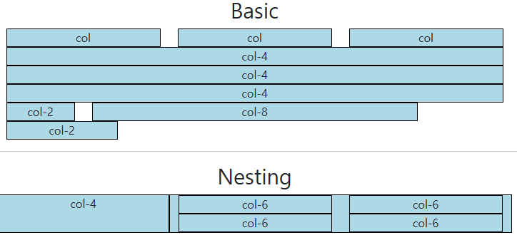
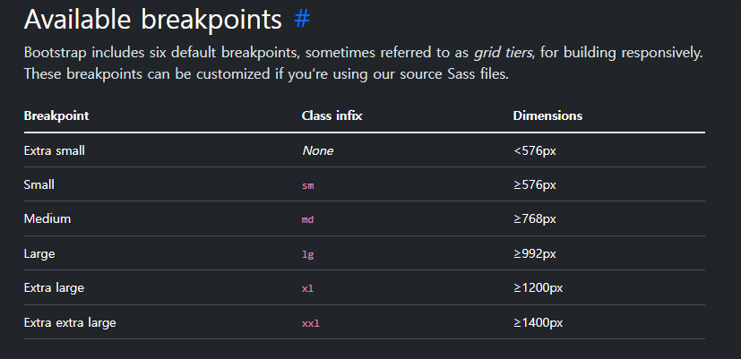

# Grid system

---

(필요성) 각 긱기마다 화면이 똑같다는 보장이 없음 -> 다양한 화면 사이즈에 대응하여 UI 요소의 배치를 바꿀 피룡가 있고, 이는 사용자의 편의 / 미적인 관점과 연관됨.


Bootstrap Grid system

: 웹 페이지의 레이아웃을 조정하는 데 사용되는
12개의 컬럼으로 구성된 시스템

-> 왜 12일까? 약수가 많음.

-> 반응형 디자인을 지원해 웹 페이지를 모바일, 태블릿, 데스크탑 등 다양한 기기에서 적절하게 표시할 수 있도록 도와준다.


### 실습 1



```html
<body>
  <h2 class="text-center">Basic</h2>
  <div class="container"> <!--container라고 적어두면, 화면이 꽉 차지 않게 되짐-->
    <div class="row">       <!-- col에다가 숫자를 쓰지 않으면 4칸씩 자동으로 나눠진다. -->
      <div class="col">
        <div class="box">col</div>
      </div>
      <div class="col">
        <div class="box">col</div>
      </div>
      <div class="col">
        <div class="box">col</div>
      </div>
    </div>
    <div class="row">       <!-- col에다가 숫자를 4칸씩 나눠줄 수 있다. -->
      <div class="col4">
        <div class="box">col-4</div>
      </div>
      <div class="col4">
        <div class="box">col-4</div>
      </div>
      <div class="col4">
        <div class="box">col-4</div>
      </div>
    </div>
    <div class="row"> <!-- 12칸을 자유롭게 분배해볼 수 있다. 다만, 12를 넘어가면 안된다. 12칸을 넘어가면 다음 행으로 넘어가버린다.-->
      <div class="col-2">
        <div class="box">col-2</div>
      </div>
      <div class="col-8">
        <div class="box">col-8</div>
      </div>
      <div class="col-3">  <!-- 12칸을 넘어가서, 마지막 상자가 다음 줄로 넘어간다-->
        <div class="box">col-2</div>
      </div>
    </div>
  </div>

  <hr>

  <h2 class="text-center">Nesting</h2>
  <div class="container"> <!--container라고 적어두면, 화면이 꽉 차지 않게 되짐-->
    <div class="row"> <!---4칸과 8칸으로 일단 크게 나누겠습니다. 61, 64줄-->
      <div class="col-4 box">
        <div>col-4</div>
      </div>
      <div class="col-8 box">
        <div class="row">
          <div class="col-6">
            <div class="box">col-6</div>
          </div>
          <div class="col-6">
            <div class="box">col-6</div>
          </div>
          <div class="col-6">
            <div class="box">col-6</div>
          </div>
          <div class="col-6">
            <div class="box">col-6</div>
          </div>
        </div>
      </div>
    </div>
  </div>

```


## 만약에 박스 간에 간격을 두고 싶다면? `offset-3`

```html
  <h2 class="text-center">Offset</h2>
  <div class="container">
    <div class="row">
      <div class="col">  <!--굳이 col-4 지정 안 해도 되긴 하는 듯-->
        <div class="box">col-4</div>
      </div>
      <div class="col-4 offset-4">
        <div class="box">col-4 offset-4</div>
      </div>
    </div>
    <div class="row"> <!--어차피 12칸 자동 분배니까, 꼭 필요한 것만 할당하면 됨.-->
      <div class="col offset-3">
        <div class="box">col-3 offset-3</div>
      </div>
      <div class="col offset-3">
        <div class="box">col-3 offset-3</div>
      </div>
    </div>
    <div class="row">
      <div class="col-6 offset-3">
        <div class="box">col-6 offset-3</div>
      </div>
    </div>
  </div>
```


Grid system에서 column 사이에 여백 영역

- x축은 padding, y축은 margin으로 여백 생성
  - x축은 container로 인해, 제한된 영역이 있다. -> margin으로 밀 수 없다. 
  - 꽉 찬 12칸 안에서, 서로를 밀어내는 것처럼 보이게 하려면, 
    padding 밖에 답이 없다.
  - 아래로는 제한이 없기 때문에,
    column끼리 실제로 밀어내는 margin으로 밀어내는 겁니다.


- Gutter를 이용해 간격을 조정해보자.

  - Gutter 좌우는 x 걸랑요. 
    Gutter를 줄 때는 row한테 줍니다. 
    행이 자기가 가지고 있는 column들의 gutter를 동일하게 컨트롤 하걸라요

    ```html
      <!-- x축 방향으로 줄 게요 -->
      <h2 class="text-center">Gutters(gx-0)</h2>
      <div class="container">
        <div class="row gx-0"> <!--col사이의 여백을 제거합니다-->
          <div class="col">
            <div class="box">col</div>
          </div>
          <div class="col">
            <div class="box">col</div>
          </div>
        </div>
      </div>
    
      <hr>
    
      <!-- y축 방향으로 줄 게요 -->
      <h2 class="text-center">Gutters(gy-5)</h2>
      <div class="container">
        <div class="row gy-5"> <!--y축 방향으로 5만큼 밀어냅니다.-->
          <div class="col-6">
            <div class="box">col</div>
          </div>
          <div class="col-6">
            <div class="box">col</div>
          </div>
          <div class="col-6">
            <div class="box">col</div>
          </div>
          <div class="col">
            <div class="box">col</div>
          </div>
        </div>
      </div>
    
      <hr>
    
        <!--상하좌우로 줄 게요.-->
      <h2 class="text-center">Gutters(g-5)</h2>
      <div class="container">
        <div class="row gx-0 gy-5">
          <div class="col-6">
            <div class="box">col</div>
          </div>
          <div class="col">
            <div class="box">col</div>
          </div>
          <div class="col-6">
            <div class="box">col</div>
          </div>
          <div class="col">
            <div class="box">col</div>
          </div>
        </div>
      </div>
    
      <script src="https://cdn.jsdelivr.net/npm/bootstrap@5.3.8/dist/js/bootstrap.bundle.min.js"
        integrity="sha384-FKyoEForCGlyvwx9Hj09JcYn3nv7wiPVlz7YYwJrWVcXK/BmnVDxM+D2scQbITxI"
        crossorigin="anonymous"></script>
    </body>
    
    </html>
    
    ```

    

우리가 아직 못 하는게 칸 수를 유동적으로 바꾸는 것입니다.

각각의 네모가 가지고 있는 칸 수를 조정하는 겁니다.

화면의 크기가 변화가 되는 정확한 시점이 필요해요.


바로, Responsive Web Design 입니다.

디바이스 종류나 화면 크기에 상관없이,

어디서든 일관된 레이아웃 및 사용자 경험을 제공하는 디자인 기술


때문에, Bootstrap grid system에서는 12개의 column과

6개의 breakpoints를 사용하여 반응형 웹 디자인을 구현




`.col-md-4` : md를 예로 들면, 768픽셀 이상으로 화면이 커지면, 768 - 991px까지의 픽셀에 대해서 4로 나누겠다.

```html
<body>
  <h2 class="text-center">Breakpoints</h2>
  <div class="container">
    <div class="row">
      <div class="col-12 col-sm-6 col-md-2 col-lg-3 col-xl-4" > 
          <!--위에 코드는 기본(가장 작은 화면)은 12, 
            스몰사이즈 이상인 동안은 6을 주겠다.(2개씩 보여주겠다.) 
            미디움 이상이면 2칸 라지 이상이면 3칸 엑스라지 이상이면 4칸이라는 뜻!-->
        <div class="box">col</div>
      </div>
      <div class="col-12 col-sm-6 col-md-8 col-lg-3 col-xl-4">
        <div class="box">col</div>
      </div>
      <div class="col-12 col-sm-6 col-md-2 col-lg-3 col-xl-4">
        <div class="box">col</div>
      </div>
      <div class="col-12 col-sm-6 col-md-12 col-lg-3 col-xl-12">
        <div class="box">col</div>
      </div>
    </div>
  </div>
```


offset도 마찬가지로 사용가능

단, offset과 col 모두 상쇄 해야한다는 것 주의

```html
  <h2 class="text-center">Breakpoints + offset</h2>
  <div class="container">
    <div class="row g-4">
      <div class="col-12 col-sm-4 col-md-6">
        <div class="box">col</div>
      </div>
      <div class="col-12 col-sm-4 col-md-6">
        <div class="box">col</div>
      </div>
      <div class="col-12 col-sm-4 col-md-6">
        <div class="box">col</div>
      </div>
      <div class="col-12 col-sm-4 offset-sm-4 offset-md-0 col-md-6 "> 
          <!--오프셋 상쇄 따로, col 상쇄 따로해야한다는 것 주의하기-->
        <div class="box">col</div>
      </div>
    </div>
  </div>

```


이렇게 지금까지 배운 모든 코드는 상호보완적으로 사용할 수 있다.


## Grid cards

