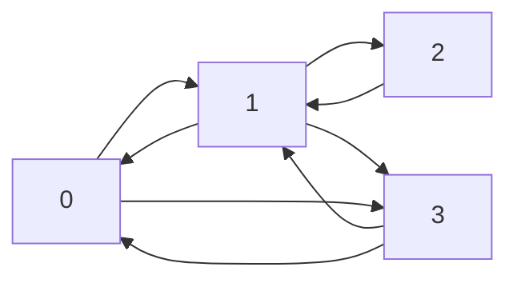
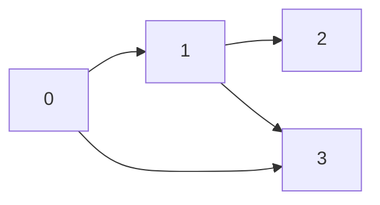
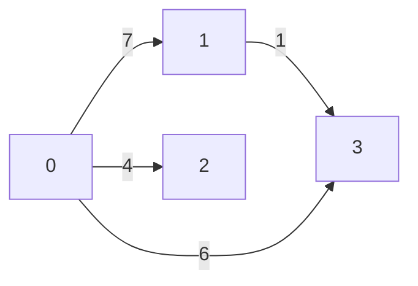
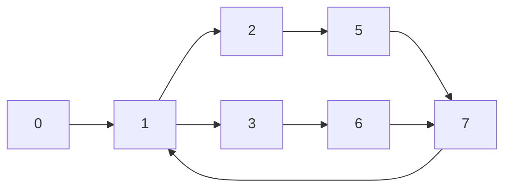
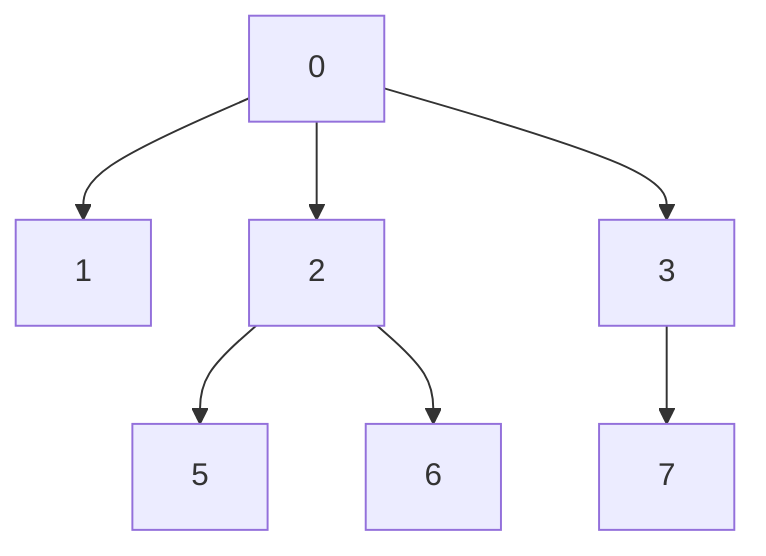
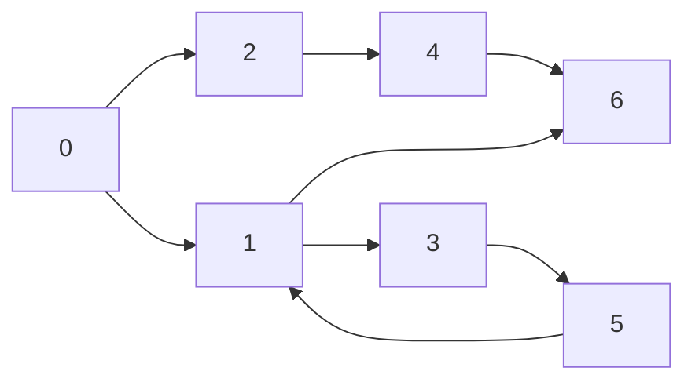
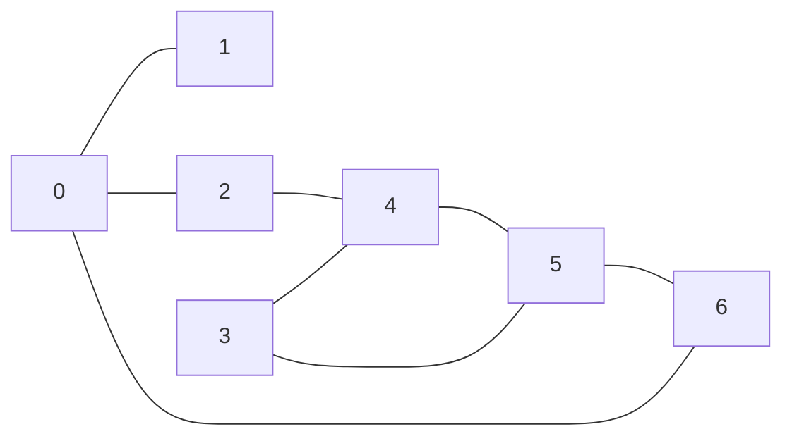

## 그래프


### 그래프란?

아이템(사물 또는 추상적 개념)들과 이들 사이의 연결 관계를 표현

- 선형 자료구조나 트리 자료구조로 표현하기 어려운 N : N 관계를 가지는 원소들을 표현하기에 용이


- 정점(Vertex)들의 집합과 이들을 연결하는 간선(Edge)들의 집합으로 구성된 자료구조

- |V| = 정점 개수, |E| = 그래프에 포함된 간선의 개수

- |V|개의 정점을 가지는 그래프가 가지는 최대 간선 개수는 아래와 같다.

  ```math
  |E|_{\max} = \binom{|V|}{2} = \frac{|V|(|V|-1)}{2}
  ```

---


### 그래프 유형 - 1

- 무향(무방향) 그래프
- 유향(방향) 그래프
- 가중치 그래프
- 사이클 없는 방향 그래프(DAG, Directed Acyclic Graph)


#### 무방향 그래프 (단순)



#### 방향 그래프




#### 가중치 그래프




#### 방향 그래프 (사이클 존재)




#### 트리 (사이클 없음)




---


### 그래프 유형 - 2

#### 완전 그래프

- 정점들에 대해 가능한 모든 간선들을 가진 그래프

#### 부분 그래프

- 원래 그래프에서 일부의 정점이나 간선을 제외한 그래프


---


### 인접 정점

- 인접(Adjacency)
  - 두 개의 정점에 간선이 존재하면 서로 인접해 있다고 한다
  - 완전 그래프에 속한 임의의 두 정점들은 모두 인접해 있다


---


### 그래프 경로

경로란 간선들을 순서대로 나열한 것

- **단순 경로** : 경로 중 한 정점을 최대한 한 번 만 지나는 경로
- **사이클** : 시작한 정점에서 끝나는 경로


그래프 경로 예시



단순경로 예시: `0 → 2 → 4 → 6`, `0 → 1 → 6`

사이클 예시: `1 → 3 → 5 → 1`


---


### 그래프 표현

간선의 정보를 저장하는 방식
메모리나 성능을 고려하여 결정

- **인접 행렬 (Adjacency Matrix)**
  - |V| × |V| 크기의 2차원 배열을 이용해서 간선 정보를 저장
- **인접 리스트 (Adjacency List)**
  - 각 정점마다 해당 정점과 인접한 정점 정보를 저장
- **간선 리스트 (Edge List)**
  - 간선 (시작 정점, 끝 정점)을 배열에 연속적으로 저장


#### 1. 인접 행렬 

두 정점을 연결하는 간선의 유무를 행렬로 표현

1. |V| × |V| 정방 행렬

   - 행 번호와 열 번호는 그래프의 정점에 대응

   - 두 정점이 인접되어 있으면 1, 그렇지 않으면 0으로 표현

   - 무향 그래프의 경우, 행렬은 대칭

   - i번째 행의 합 = i번째 열의 합 = 정점 Vi의 차수


(예시) 무향(이라고 봐주세요) 그래프



(예시) 인접 행렬

|      | 0    | 1    | 2    | 3    | 4    | 5    | 6    |
| ---- | ---- | ---- | ---- | ---- | ---- | ---- | ---- |
| 0    | 0    | 1    | 1    | 0    | 0    | 0    | 1    |
| 1    | 1    | 0    | 0    | 0    | 0    | 0    | 0    |
| 2    | 1    | 0    | 0    | 0    | 1    | 0    | 0    |
| 3    | 0    | 0    | 0    | 0    | 1    | 1    | 0    |
| 4    | 0    | 0    | 1    | 1    | 0    | 1    | 0    |
| 5    | 0    | 0    | 0    | 1    | 1    | 0    | 1    |
| 6    | 1    | 0    | 0    | 0    | 0    | 1    | 0    |

 2. 유향 그래프 (이번 슬라이드)

    - 인접 행렬은 일반적으로 비대칭.

    - `(i,j)`가 `1`이면, "정점 i → 정점 j" 간선 존재.

    - **행 i 의 합 = 정점 i의 진출 차수**

    - **열 i 의 합 = 정점 i의 진입 차수**


- 인접 행렬의 단점
  - 정점 수에 비해 간선 수가 적은 경우 공간 낭비가 심하다.

---


#### 인접 리스트

- 각 정점에 대한 인접 정점들을 순차적으로 표현
- 하나의 정점에 대한 인접 정점들을 각각 노드로 하는 연결리스트로 저장.


- **무향 그래프의 인접 리스트** (이미지 속 화살표 무시)

  ```mermaid
  graph LR
      0 --> 1
      0 --> 2
      0 --> 5
      0 --> 6
      4 --> 3
      5 --> 3
      5 --> 4
      6 --> 4
  ```

  - 0 → [1, 2, 5, 6]

  - 1 → [0]

  - 2 → [0]

  - 3 → [4, 5]

  - 4 → [3, 5, 6]

  - 5 → [0, 3, 4]

  - 6 → [0, 4]

- 무방향 그래프 노드 수 = 간선의 수 * 2
- 각 정점의 노드 수 = 정점의 차수


- **유향 그래프의 인접 리스트**

  ```mermaid
  graph LR
      0 --> 1
      0 --> 2
      0 --> 5
      0 --> 6
      4 --> 3
      5 --> 3
      5 --> 4
      6 --> 4
  ```

  - 0 → [1, 2, 5, 6]
  - 1 → 
  - 2 → 
  - 3 → 
  - 4 → [3]
  - 5 → [3, 4]
  - 6 → [4]

- 방향 그래프 노드 수 = 간선의 수

- 각 정점의 노드 수 = 정점의 진출 차수