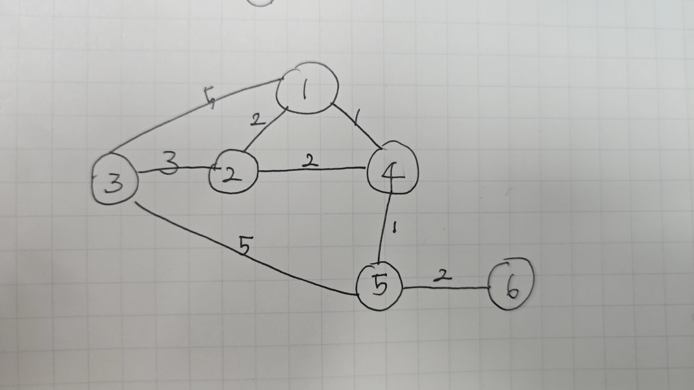

# **최단 경로(Shortest Path)**

<aside>
💡

간선의 가중치가 있는 그래프에서 두 정점 사이의 경로들 중에 간선의 가중치의 합이 최소인 경로

</aside>

# **1. 최단 경로란 무엇일까?**

### **1.1 개념: 내비게이션 길 찾기**

**최단 경로(Shortest Path)** 문제는 그래프의 두 정점 사이를 잇는 여러 경로 중, **간선의 가중치 합이 최소가 되는 경로**를 찾는 문제입니다.

이는 마치 내비게이션 앱에서 "A 지점에서 B 지점까지 **가장 빠른 길**로 안내해 줘"라고 요청하는 것과 같습니다. 이때 각 도로는 **간선(Edge)**, 교차로는 **정점(Vertex)**, 도로를 지나는 데 걸리는 시간이나 거리는 **가중치(Weight)**가 됩니다.

- **단일 출발 최단 경로 (Single-Source Shortest Path):** 특정 **시작 정점**에서 다른 **모든 정점**까지의 최단 경로를 찾는 문제. (예: 우리 집에서 다른 모든 친구 집까지 가는 최단 경로)
- **모든 쌍 최단 경로 (All-Pairs Shortest Path):** **모든 정점 쌍** 사이의 최단 경로를 찾는 문제.

우리는 이 중 가장 대표적인 '단일 출발 최단 경로' 문제의 해법인 **다익스트라 알고리즘**을 집중적으로 학습합니다.

## **2.1 핵심 아이디어: 가장 가까운 곳부터 확정하기**

다익스트라 알고리즘은 **그리디(Greedy) 접근법**을 사용합니다.

1. 출발점에서 각 정점까지의 거리를 기록할 `distance` 배열을 만듭니다. (출발점은 0, 나머지는 무한대(INF)로 초기화)
2. **현재까지 알려진 가장 가까운(최단 거리가 가장 짧은) 노드**를 하나 선택합니다.
3. 선택한 노드를 거쳐 다른 노드로 가는 경로가, 기존에 알려진 경로보다 더 짧다면 `distance` 배열의 값을 **갱신**합니다.
4. 모든 노드를 방문할 때까지(q가 빌 때까지ㄴ) 2~3번 과정을 반복합니다.

