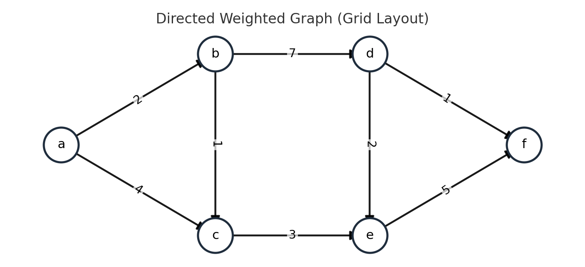

## 최단경로

#### (정의)

간선의 가중치가 있는 그래프에서 두 정점 사이의 경로들 중에 간선의 가중치의 합이 최소인 경로

**누적 비용이 작은 곳으로 가자**는 컨셉을 따르면 됩니다.

#### (종류)

1. **하나의 시작** 정점에서 끝 정점까지의 최단 경로
   (다른 모든 연결된 정점들까지의 최단경로를 모두 구할 수 있습니다)
   1. 다익스트라(dijkstra) 알고리즘 - **음의 가중치를 허용하지 않음**
   2. 벨만-포드(Bellman-Ford) 알고리즘 - 음의 가중치 허용
      
2. **모든 정점**들에 대한 최단 경로
   1. 플로이드-워샬(Floyd-Warshall) 알고리즘

---

### Dijkstra 알고리즘

#### (정의)

시작 정점에서 거리가 최소인 정점을 선택해 나가면서
최단 경로를 구하는 방식

- 시작 정점(s)에서 끝 정점(t)까지의 최단 경로에 정점 x가 존재함
- 이때, 최단 경로는 s에서 x까지의 최단 경로와 x에서 t까지의 최단 경로로 구성됨
- **탐욕 기법**을 사용한 알고리즘으로 MST의 Prim 알고리즘과 유사함.
  *prim은 무조건 작은 것을 구한다. dijkstra는 누적 거리가 작은 것을 고른다.*

예시랑 같이 보자

구해야 하는 것은 두 가지

1. 누적 거리 리스트를 구해야하고

   |      | a    | b    | c    | d    | e    | f    |
   | ---- | ---- | ---- | ---- | ---- | ---- | ---- |
   |      | 0    | 2    | 4    | inf  | inf  | inf  |

2. 후보군 (누적 거리가 짧은 경로를 먼저 꺼냄, pq) 을 구해야함.

​	`(0, a) (2, b) (4, c)                 `      

그리고, 후보pq에 넣는 순간, 누적 거리 리스트를 작은 값으로 갱신을 해주어야
비효율을 방지할 수 있을 것이다.