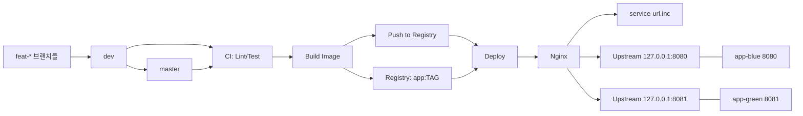
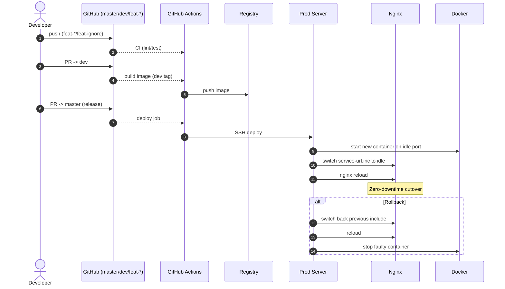
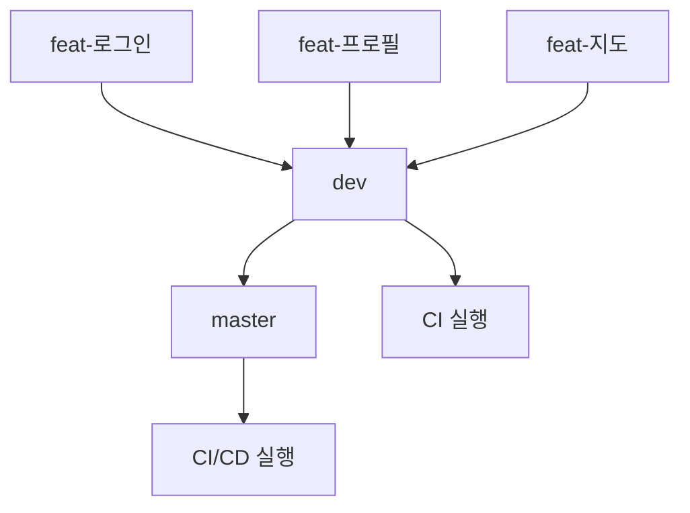
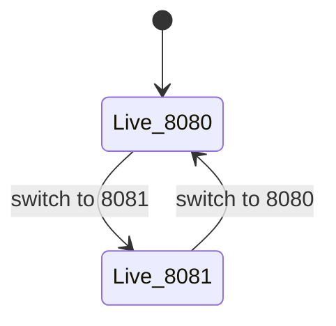

### 1. 전체 아키텍처 개요

GitHub 브랜치 → CI/CD → Registry → Prod Server(Nginx + Docker)로 이어지는 전체 배포 아키텍처 흐름.

### 2. 배포 과정

개발자의 푸시부터 PR, 빌드, 레지스트리 푸시, 서버 배포, Nginx 전환, 롤백까지 이어지는 무중단 배포 시퀀스

### 3. 브랜치 전략

`feat-*` 브랜치는 `dev`로 머지되어 CI만 수행, `dev`는 `master`로 머지되어 최종 CI/CD가 실행

### 4. Blue/Green 상태 전환

무중단 배포법 : Blue/Green 방식으로 포트(8080/8081)를 교차 전환하며 서비스 중단 없이 새 버전 배포

### 5. CI / CD 타임라인

```mermaid
gantt
  dateFormat  HH:mm
  title CI/CD 파이프라인 (master 기준)
  section CI
  Lint/Test            :done,  des1, 00:00, 10m
  Build Image          :active, des2, 00:10, 8m
  Push to Registry     :        des3, 00:18, 4m
  section CD
  Start Idle Container :        des4, 00:22, 3m
  Health Check         :        des5, 00:25, 2m
  Swap & Reload        :        des6, 00:27, 1m
  Retire Old           :        des7, 00:28, 2m

```

master 배포 시 CI/CD 단계별 소요 시간(빌드 → 레지스트리 → 서버 배포 → 헬스체크 → 전환 → 롤백)을 Gantt 차트로 표현