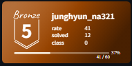
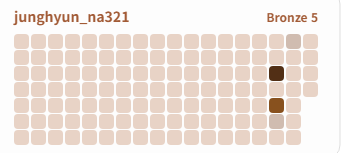
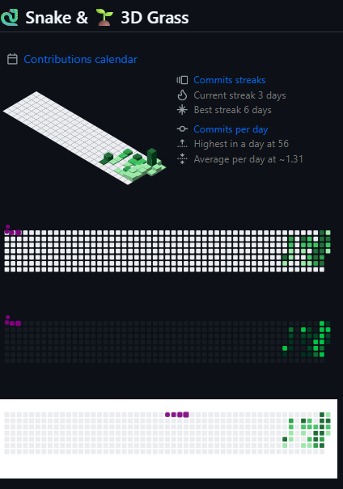

# 1. 깃허브에 백준 티어 배지 넣기

```
[](https://solved.ac/junghyun_na321)
```

junghyun_na321을 여러분의 백준 아이디로 바꾸시면 됩니다

더 많은 배지 커스텀은 [링크](https://github.com/mazassumnida/mazassumnida)를 참고해주세요 




------

## 2. 백준허브

[BaekjoonHub/BaekjoonHub: 백준 자동 푸시 익스텐션(Auto Git Push for BOJ)](https://github.com/BaekjoonHub/BaekjoonHub)

thanks to 우성님.

여러분들이 백준이나 SWEA에서 문제풀이 진행하면 깃허브로 자동푸시해주는 기능입니다 

------

## 3. 깃허브 프로필에 백준잔디 넣기

```
[](https://solved.ac/profile/junghyun_na321)
```

마찬가지로 junghyun_na321을 바꿔주세요 



------

## 4. <핵심?!> 깃허브 잔디 꾸미기

# [클릭](https://github.com/najung-h/WIL/tree/master/깃허브_잔디_꾸미기_0826)

근데 약간 코드 수정중이라 천천히 해보셔용 ㅎㅎ 



------

# 5. 깃허브 맞팔

- [정현](https://github.com/najung-h)

- [유정](https://github.com/yjspheal)
- [소희](https://github.com/hann2a)
- [준아](https://github.com/ajjoona-git)
- [민규](https://github.com/mingyukang5420)
- [우성](https://github.com/13aek)
- [환승](https://github.com/hwanseung251)

# 6. 추천 문제 목록

[추천문제목록](https://www.notion.so/Advanced-2303cb37136a81f18460e8308af94255)

- A형 미취득자는 SWEA 문제를,
- A형 취득자는 백준 문제를 권장합니다.
- 개발자 취업을 위해서는 백준티어 기준 `골드 상위` - `플레티넘 하위`가 필요하다고 합니다. 
- 그날까지 모두 화이팅