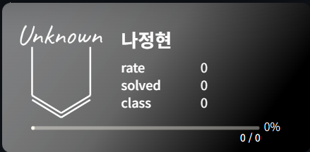
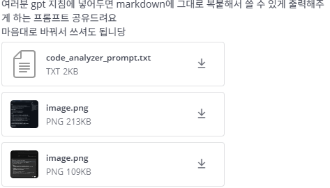
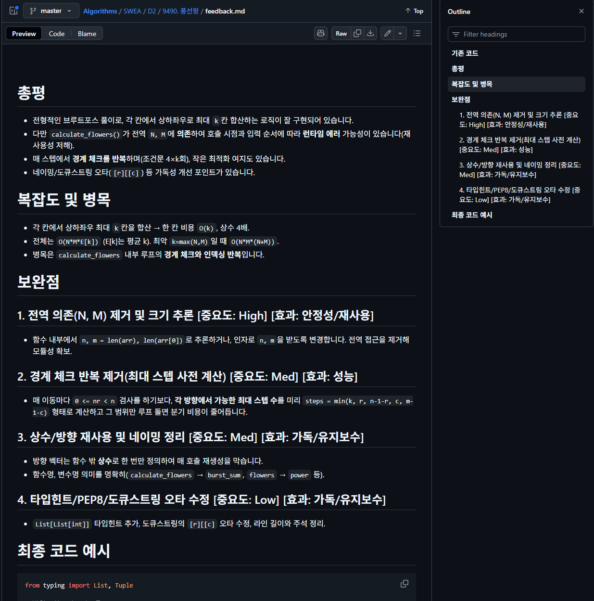

# 1. 깃허브에 백준 티어 배지 넣기

[정현]



깃허브 README.md에 백준 티어 넣는 방법 공유드립니다.

```
[](https://solved.ac/junghyun_na321)
```

junghyun\_na321을 여러분의 백준 아이디로 바꾸시면 됩니다

더 많은 배지 커스텀은 [링크](https://github.com/mazassumnida/mazassumnida)를 참고해주세요


---


# 2. gpt 코드 분석 프롬프트 공유

[유정]

 




---


# 3. 백준허브

[우성]

[BaekjoonHub/BaekjoonHub: 백준 자동 푸시 익스텐션(Auto Git Push for BOJ)](https://github.com/BaekjoonHub/BaekjoonHub)

백준 문제 자동 푸시 해주는 확장 프로그램 공유 다시 한번 드릴게요!